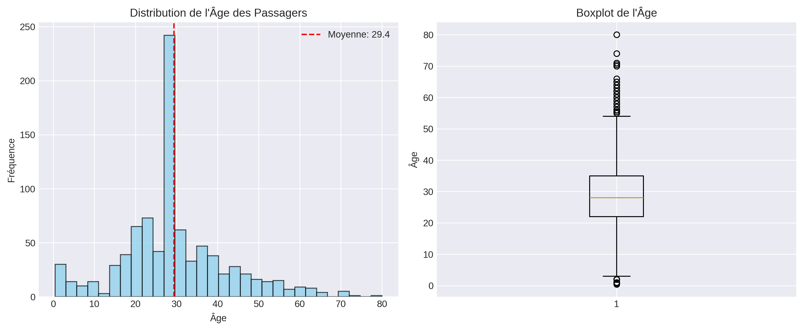
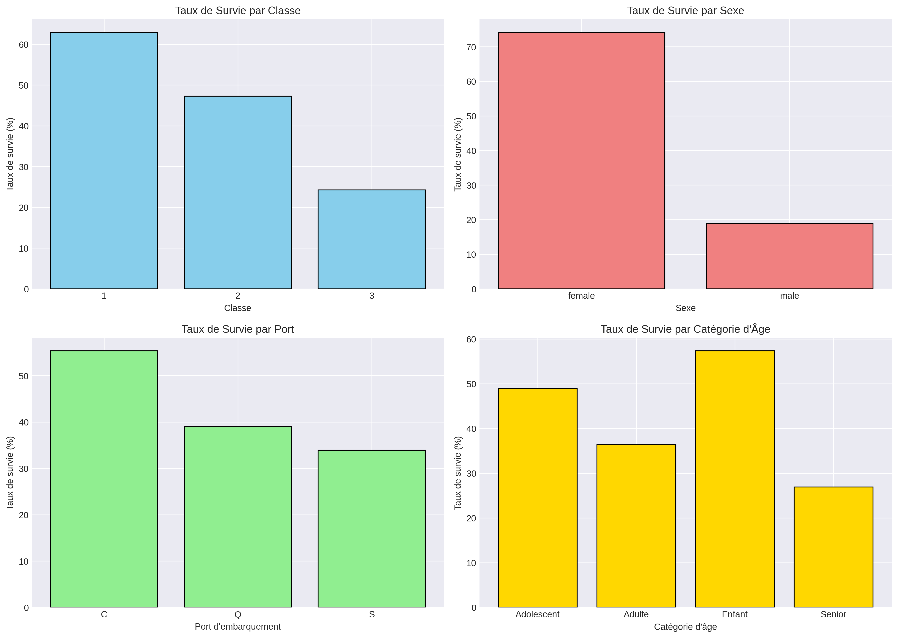
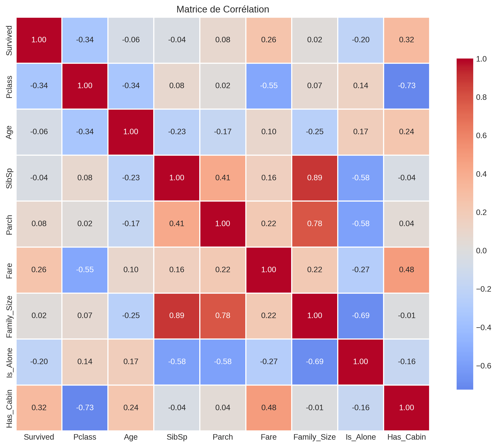

# 🚢 Analyse du Titanic - Facteurs de Survie

## 📋 Description

Analyse exploratoire complète du dataset Titanic pour identifier les facteurs qui ont influencé la survie des passagers lors du naufrage du 15 avril 1912.

## 🎯 Objectifs

- Nettoyer et préparer les données (891 passagers)
- Identifier les variables impactant la survie
- Créer des visualisations pour communiquer les insights
- Fournir des conclusions basées sur les données

## 🛠️ Technologies Utilisées

- **Python 3.11**
- **Pandas** - Manipulation de données
- **NumPy** - Calculs numériques
- **Matplotlib & Seaborn** - Visualisation
- **Jupyter Notebook** - Analyse interactive

## 📊 Résultats Clés

### 💀 Taux de Survie Global : 38.4%

### Facteurs Déterminants :

#### 1. 👥 **Sexe** - Impact majeur
- **Femmes** : 74% de survie
- **Hommes** : 19% de survie
- ➡️ Les femmes avaient **3.9x plus de chances** de survivre
- Principe "Femmes et enfants d'abord" appliqué

#### 2. 🎫 **Classe Sociale** - Inégalités flagrantes
- **1ère classe** : 63% de survie
- **2ème classe** : 47% de survie
- **3ème classe** : 24% de survie
- ➡️ Accès privilégié aux canots de sauvetage pour les classes supérieures

#### 3. 🧒 **Âge** - Protection des enfants
- Âge moyen des survivants : ~28 ans
- Âge moyen des décédés : ~30 ans
- Les enfants (<12 ans) avaient un meilleur taux de survie
- ➡️ Priorisation des enfants dans l'évacuation

#### 4. 👨‍👩‍👧 **Taille de Famille**
- Personnes seules : taux de survie plus faible
- Familles de 2-4 personnes : meilleur taux
- Très grandes familles : taux réduit
- ➡️ Difficulté de coordination pour grandes familles

## 📈 Visualisations

### Distribution de l'Âge

### Taux de Survie par Variables

### Matrice de Corrélation

## 💡 Insights Business

Cette analyse révèle que **la survie sur le Titanic n'était PAS aléatoire** mais fortement influencée par :

1. **Protocoles d'évacuation** : "Femmes et enfants d'abord" strictement appliqué
2. **Inégalités sociales** : Accès différencié aux canots selon la classe
3. **Position sur le navire** : Passagers 1ère classe plus proches des canots
4. **Facteurs culturels** : Normes sociales de l'époque (1912)

### Applications modernes :
- **Gestion de crise** : Importance de protocoles d'évacuation clairs
- **Design de sécurité** : Accès équitable aux sorties de secours
- **Analyse prédictive** : Identification des groupes à risque

## 📁 Fichiers du Projet
