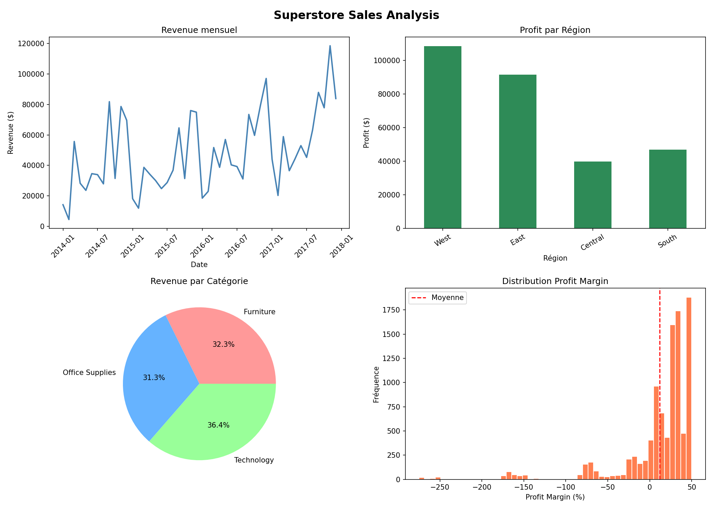

# 🛒 Superstore Sales Analysis — Retail Performance Dashboard

## 📋 Description
Analyse exploratoire et business complète du dataset **Sample Superstore** (Kaggle), couvrant **9 994 transactions** sur 4 ans (2014-2017) dans une chaîne retail américaine opérant dans 4 régions et 3 catégories de produits.

L'objectif est d'identifier les leviers de croissance, les zones de perte et de formuler des recommandations actionnables pour la direction.

---

## 🎯 Objectifs Analytiques
- Nettoyer et enrichir les données (feature engineering : profit margin, delivery time)
- Analyser la performance par région, catégorie et sous-catégorie
- Mesurer l impact des politiques de discount sur la rentabilité
- Dégager des tendances temporelles (revenue mensuel, croissance MoM)
- Produire un dashboard visuel communicable aux décideurs

---

## 🛠️ Stack Technique
| Outil | Usage |
|-------|-------|
| Python 3.13 | Langage principal |
| NumPy | Vectorisation, broadcasting, calculs matriciels |
| Pandas | GroupBy, Pivot Tables, Time Series, Merge |
| Matplotlib | Dashboard multi-graphiques |
| Jupyter Notebook | Analyse interactive et reproductible |

---

## 📊 Résultats Clés

### 💰 KPIs Globaux
| Métrique | Valeur |
|----------|--------|
| Chiffre d affaires total | 2 297 201 USD |
| Profit total | 286 397 USD |
| Marge moyenne | 12.47% |
| Nombre de commandes | 5 009 |
| Délai de livraison moyen | 3.96 jours |

---

### 1. 🗺️ Performance Régionale
- **West** : région la plus performante en revenue et profit
- **Central** : marges les plus faibles malgré un volume correct
- **South** : potentiel sous-exploité
- ➡️ *Recommandation : dupliquer le modèle commercial de la région West*

### 2. 📦 Analyse par Catégorie
- **Technology** : meilleure marge nette, produits phares = Phones et Laptops
- **Office Supplies** : volume élevé mais faible valeur unitaire
- **Furniture** : catégorie problématique — plusieurs sous-catégories en perte
- ➡️ *Recommandation : revoir le pricing Furniture, booster Technology*

### 3. 🏷️ Impact des Discounts — Insight Critique
| Discount | Profit moyen par commande |
|----------|--------------------------|
| 0% | Positif |
| 10-20% | Légèrement positif |
| 30-50% | Négatif (perte sèche) |

- ➡️ *Tout discount supérieur à 20% détruit de la valeur*
- ➡️ *Recommandation : plafonner les remises commerciales à 20%*

### 4. 📉 Sous-catégories en Perte
- **Tables** : perte nette sur l ensemble de la période
- **Bookcases** : marges négatives récurrentes
- **Supplies** : rentabilité insuffisante
- ➡️ *Recommandation : audit tarifaire ou abandon de ces lignes produits*

---

## 📈 Visualisations

*Dashboard 4 panels : Revenue mensuel | Profit par région | Répartition CA | Distribution des marges*

---

## 💡 Recommandations Business

1. **Politique de discount** : Instaurer un plafond strict à 20% — au-delà, chaque vente est une perte
2. **Priorité Technology** : Augmenter les investissements marketing sur la catégorie la plus rentable
3. **Restructuration Furniture** : Révision tarifaire des Tables et Bookcases ou retrait du catalogue
4. **Expansion géographique** : Le modèle West est le benchmark à reproduire dans les autres régions
5. **Optimisation logistique** : Réduire le délai moyen sous 3.5 jours pour améliorer la satisfaction client

---

## 📁 Structure du Projet
    02-superstore-sales/
    ├── jour2_numpy_superstore.ipynb   # Notebook d analyse complet
    ├── superstore_analysis.png        # Dashboard de visualisations
    └── README.md                      # Documentation projet

---

## 🔗 Données
- **Source** : [Kaggle - Superstore Dataset](https://www.kaggle.com/datasets/vivek468/superstore-dataset-final)
- **Période** : Janvier 2014 — Décembre 2017
- **Volumétrie** : 9 994 lignes × 21 colonnes

---

*Projet réalisé dans le cadre d un parcours intensif Data Analyst — Jour 2/28*
