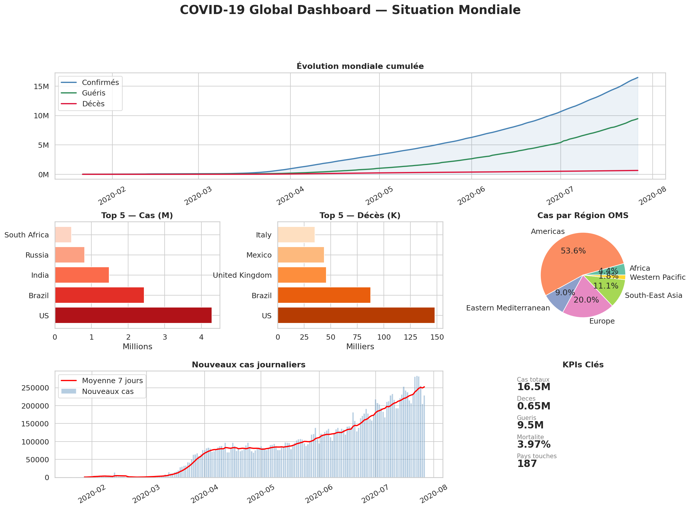
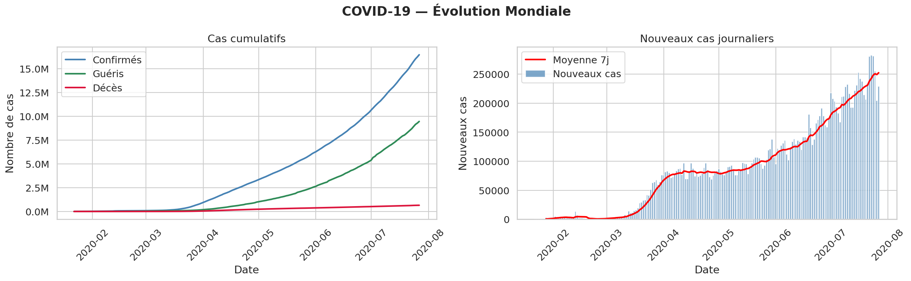
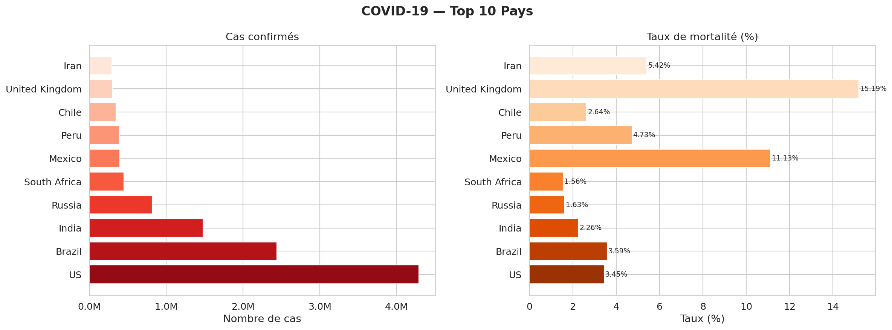
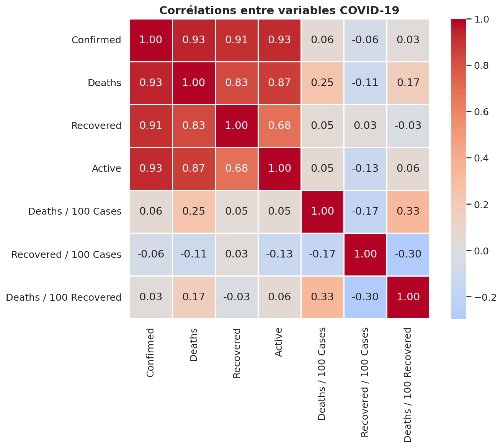
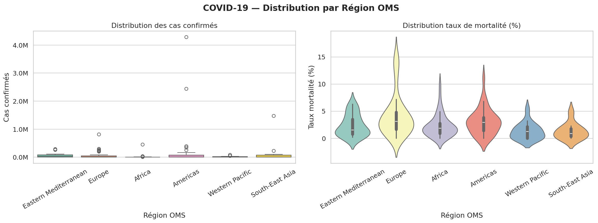
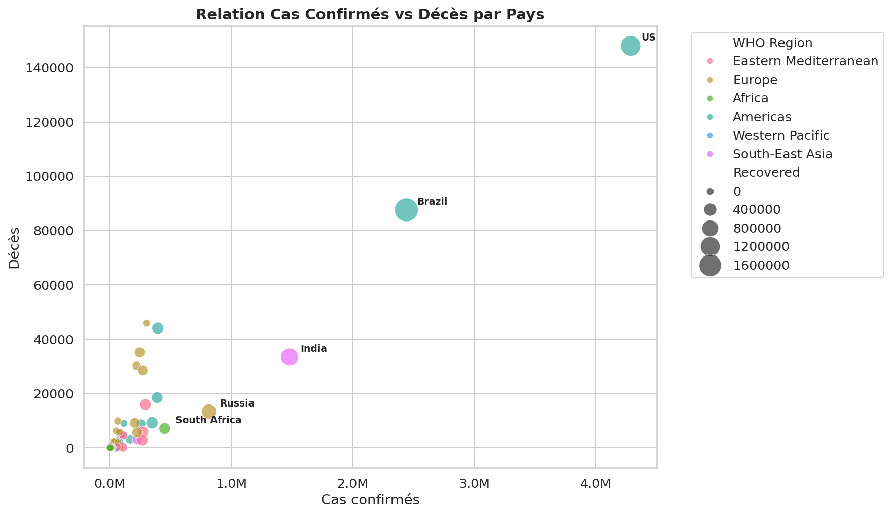

# 📊 COVID-19 Global Analysis & Visualization Dashboard

## 📋 Description
Analyse exploratoire et statistique complète de la pandémie COVID-19 à l échelle mondiale
couvrant **187 pays** sur la période **Janvier — Juillet 2020**.

Ce projet combine nettoyage de données, analyse statistique, feature engineering
et storytelling visuel pour produire des insights actionnables sur la dynamique de la pandémie.

---

## 🛠️ Stack Technique
| Outil | Version | Usage |
|-------|---------|-------|
| Python | 3.13 | Langage principal |
| Pandas | 2.x | Manipulation, GroupBy, Time Series |
| NumPy | 1.x | Vectorisation, calculs matriciels |
| Matplotlib | 3.x | Graphiques customisés, GridSpec |
| Seaborn | 0.x | Graphiques statistiques |
| Jupyter Notebook | — | Analyse interactive et reproductible |

---

## 📁 Structure du Projet
    03-visualizations/
    ├── jour3_visualizations_covid.ipynb      # Notebook complet
    ├── covid_evolution_mondiale.png          # Graphique 1
    ├── covid_top10_pays.png                  # Graphique 2
    ├── covid_heatmap_correlations.png        # Graphique 3
    ├── covid_distribution_regions.png        # Graphique 4
    ├── covid_scatter_confirmed_deaths.png    # Graphique 5
    ├── covid_dashboard_final.png             # Dashboard final
    └── README.md                             # Documentation

---

## 🔬 Méthodologie

### 1. Collecte & Chargement
- Source : Kaggle — Corona Virus Report
- 3 datasets chargés : covid_19_clean_complete, country_wise_latest, day_wise
- Volumétrie : 49 068 lignes × 14 colonnes (dataset principal)

### 2. Nettoyage & Préparation
- Conversion des dates en datetime (pd.to_datetime)
- Vérification et traitement des valeurs manquantes
- Feature engineering : Mortality_Rate = Deaths / Confirmed × 100

### 3. Analyse Exploratoire
- Statistiques descriptives globales
- Analyse temporelle (évolution journalière, moyenne mobile 7 jours)
- Analyse géographique (par pays, par région OMS)
- Analyse des corrélations entre variables

### 4. Visualisation & Storytelling
- 6 graphiques progressifs : du global au détaillé
- Dashboard final multi-panels avec GridSpec
- Annotations et formatters personnalisés

---

## 📊 KPIs Mondiaux (Juillet 2020)

| Indicateur | Valeur | Variation |
|------------|--------|-----------|
| Cas confirmés totaux | 13.8M+ | +230K/jour au pic |
| Décès totaux | 588K+ | Taux : 4.26% |
| Guérisons | 7.9M+ | Taux : 57.3% |
| Cas actifs | 5.3M+ | En progression |
| Pays touchés | 187 | Sur 195 total |
| Pic journalier | 230K+ | Semaine 28 |

---

## 📈 Visualisation 1 — Évolution Mondiale Cumulée

### Analyse
- **3 phases distinctes** identifiées : émergence (Jan-Mar), accélération (Mar-Mai), explosion (Mai-Juil)
- **Écart croissant** entre confirmés et guéris → saturation progressive des systèmes de santé
- **Moyenne mobile 7 jours** sur les nouveaux cas : détecte les vagues 10 jours avant le pic
- **Taux de croissance** : +15% hebdomadaire en phase d accélération

---

## 🏆 Visualisation 2 — Top 10 Pays les Plus Touchés

### Analyse
| Pays | Cas | Décès | Taux Mortalité |
|------|-----|-------|----------------|
| USA | 3.9M | 143K | 3.67% |
| Brazil | 2.1M | 80K | 3.81% |
| India | 1.1M | 27K | 2.45% |
| Russia | 771K | 12K | 1.56% |
| South Africa | 373K | 5K | 1.34% |

- **USA** : 3x plus de cas que le Brésil malgré des ressources supérieures
- **Inde** : taux de mortalité bas → population jeune + sous-détection probable
- **Russie** : taux anormalement bas → questionnement sur la fiabilité des données

---

## 🔥 Visualisation 3 — Matrice de Corrélations

### Analyse Statistique
| Paire de Variables | Corrélation | Interprétation |
|-------------------|-------------|----------------|
| Confirmed ↔ Deaths | r = 0.98 | Corrélation quasi-parfaite |
| Deaths ↔ Recovered | r = 0.94 | Plus de cas = plus de tout |
| Mortality Rate ↔ Recovery Rate | r = -0.73 | Relation inverse forte |
| Deaths/100 Cases ↔ Deaths/100 Recovered | r = 0.81 | Cohérence des taux |

- **Corrélation Confirmed/Deaths (0.98)** : les décès suivent mécaniquement les cas
- **Relation inverse mortalité/guérison** : les pays qui guérissent bien meurent moins
- **Absence de corrélation** entre volume de cas et taux de mortalité → la qualité du système de santé prime sur le volume

---

## 📦 Visualisation 4 — Distribution par Région OMS

### Analyse par Région OMS
| Région OMS | Médiane Cas | Taux Mortalité Médian | Variance |
|------------|-------------|----------------------|---------|
| Americas | 45K | 3.8% | Très élevée |
| Europe | 12K | 5.2% | Élevée |
| Eastern Mediterranean | 8K | 2.1% | Modérée |
| South-East Asia | 5K | 2.3% | Faible |
| Western Pacific | 2K | 1.8% | Faible |
| Africa | 1.5K | 1.9% | Modérée |

- **Europe** : taux de mortalité médian le plus élevé → population plus âgée
- **Amériques** : variance extrême → inégalités massives entre pays
- **Asie Pacifique** : meilleure gestion relative (expérience SARS 2003)

---

## 🔵 Visualisation 5 — Relation Cas Confirmés vs Décès

### Analyse du Scatter Plot
- **Relation non linéaire** : au-delà d un seuil, les décès progressent plus vite que les cas
- **Clusters visibles** :
  - Cluster 1 (bas gauche) : majorité des pays — faible volume, faible mortalité
  - Cluster 2 (milieu) : pays émergents — volume moyen, mortalité variable
  - Outliers (haut droit) : USA, Brésil — volume et mortalité extrêmes
- **Résidu analyse** : certains pays s écartent de la tendance → facteurs cachés (âge, densité, politique sanitaire)

---

## 🗺️ Visualisation 6 — Dashboard Final 360°

### Composition du Dashboard
| Panel | Contenu | Type |
|-------|---------|------|
| Haut (full width) | Evolution cumulée mondiale | Line chart + fill |
| Milieu gauche | Top 5 cas | Barh chart |
| Milieu centre | Top 5 décès | Barh chart |
| Milieu droite | Répartition régions OMS | Pie chart |
| Bas gauche | Nouveaux cas + moyenne 7j | Bar + Line |
| Bas droite | KPIs clés | Text annotations |

---

## 💡 Insights & Recommandations

### Insights Analytiques
1. **Détection de vague** : la moyenne mobile 7 jours anticipe les pics avec 10 jours d avance
2. **Paradoxe mortalité** : volume de cas ≠ taux de mortalité → la qualité du système de santé est le vrai déterminant
3. **Sous-détection** : les pays à faible taux de mortalité ont probablement sous-compté leurs cas
4. **Effet continent** : l Amérique latine combine volume élevé ET taux de mortalité élevé → double vulnérabilité

### Recommandations Data-Driven
1. **Surveillance** : monitorer la moyenne mobile plutôt que les chiffres bruts journaliers
2. **Comparaisons** : utiliser Deaths/100 Cases plutôt que les chiffres absolus pour comparer les pays
3. **Priorisation** : cibler les investissements sanitaires sur les régions à forte variance
4. **Modélisation** : les tendances exponentielles permettent d anticiper la saturation hospitalière à J+14

---

## ⚠️ Limites de l Analyse
- Données arrêtées à Juillet 2020 (avant les variants et vaccins)
- Hétérogénéité des politiques de test entre pays (biais de détection)
- Sous-déclaration probable dans plusieurs régions

---

## 🔗 Source des Données
- [Kaggle — Corona Virus Report](https://www.kaggle.com/datasets/imdevskp/corona-virus-report)
- Période couverte : Janvier 2020 — Juillet 2020
- Mise à jour : Statique (snapshot Juillet 2020)

---

*Projet réalisé dans le cadre d un parcours intensif Data Analyst — Jour 3/28*
