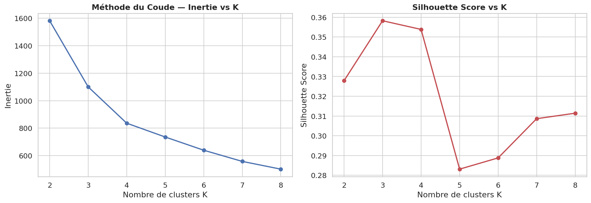
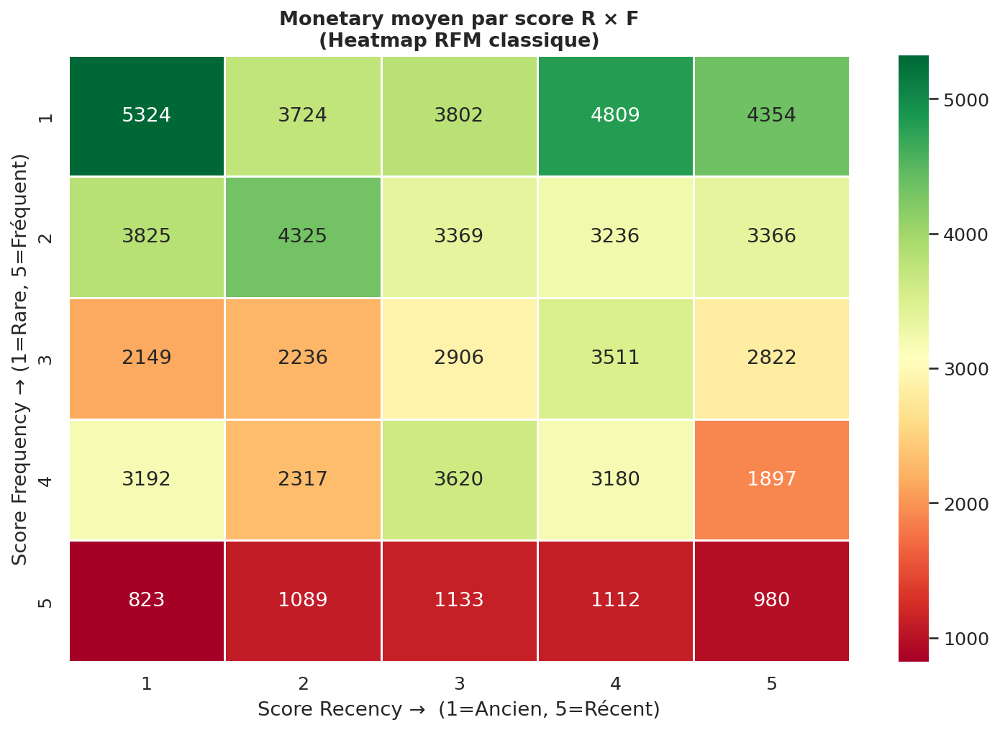
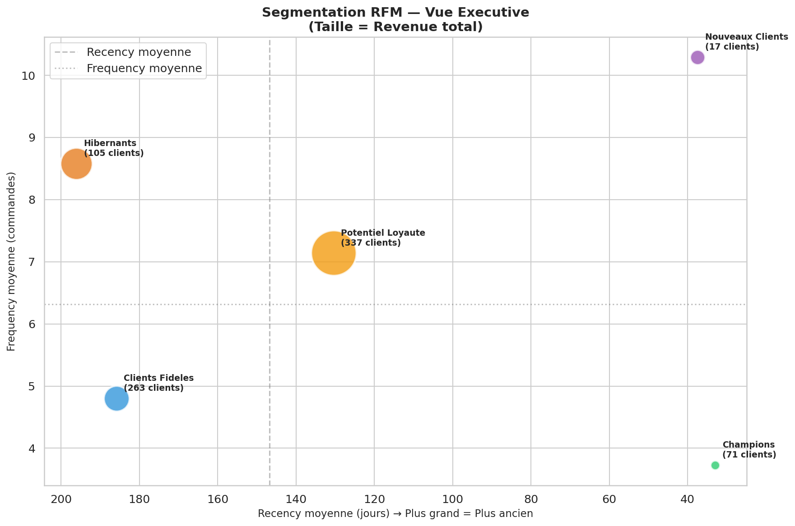

# 🎯 Analyse RFM Avancée — Segmentation & Prédiction Churn


## 📋 Description
Projet complet de **segmentation clients RFM** combinant SQL avancé, statistiques
inférentielles, clustering non-supervisé (K-Means) et modèle prédictif de churn
(Random Forest) sur 793 clients du dataset Superstore (2014-2017).

Ce projet adopte une approche **Data Scientist rigoureuse** : validation statistique
des segments, détection et correction d anomalies de scoring, comparaison de méthodes
de segmentation, et modèle prédictif avec interprétation des facteurs de risque.

---

## 🛠️ Stack Technique
| Outil | Usage |
|-------|-------|
| PostgreSQL 18 | Calcul RFM 100% en SQL |
| CTEs chaînées | Pipeline en 4 étapes lisibles |
| NTILE(5) OVER | Scoring par quintiles |
| Window Functions | LAG, LEAD, ROW_NUMBER, RANK |
| SQLAlchemy | Connexion Python → PostgreSQL |
| Pandas | Agrégations et transformations |
| Scikit-learn | K-Means + Random Forest |
| SciPy | Tests statistiques ANOVA, Shapiro-Wilk |
| Matplotlib/Seaborn | Dashboard 8 visualisations |

---

## 🔬 Méthodologie

### Pipeline complet
    1. SQL        → Calcul Recency, Frequency, Monetary par client
    2. SQL        → Scoring NTILE(5) sur chaque dimension
    3. SQL        → Segmentation par règles CASE WHEN
    4. Python     → Validation statistique des segments (ANOVA, Shapiro)
    5. Scikit-learn → Clustering K-Means pour validation non-supervisée
    6. Scikit-learn → Modèle prédictif de churn (Random Forest)
    7. Dashboard  → Visualisation executive multi-panels

### Anomalie détectée et corrigée 🔍
Lors de l analyse initiale, une **inversion du score Recency** a été détectée :
la requête initiale attribuait le score 5 aux clients les plus anciens — exactement
l inverse de la logique RFM standard.

```sql
-- AVANT (incorrect) : ancien → score 5
NTILE(5) OVER (ORDER BY recency_days ASC)

-- APRÈS (correct) : récent → score 5
NTILE(5) OVER (ORDER BY recency_days DESC)
```
Cette détection démontre l importance de la **validation croisée des résultats**
avant toute interprétation — réflexe fondamental en Data Science.

---

## 📊 Résultats RFM par Segment

| Segment | Clients | % | Recency moy | Frequency moy | Monetary moy | Revenue total |
|---------|---------|---|-------------|---------------|--------------|---------------|
| Potentiel Loyaute | 337 | 42.5% | 130 jours | 7.14 | 3 447 USD | 1 161 600 USD |
| Clients Fideles | 263 | 33.2% | 186 jours | 4.80 | 1 418 USD | 372 988 USD |
| Hibernants | 105 | 13.2% | 196 jours | 8.58 | 5 541 USD | 581 828 USD |
| Champions | 71 | 9.0% | 33 jours | 3.73 | 733 USD | 52 011 USD |
| Nouveaux Clients | 17 | 2.1% | 37 jours | 10.29 | 7 575 USD | 128 775 USD |

**Revenue total analysé : 2 297 201 USD**

---

## 🧪 Validation Statistique des Segments

### Test ANOVA — Les segments sont-ils réellement distincts ?
| Métrique | Valeur | Interprétation |
|----------|--------|----------------|
| F-statistique | **124.17** | Variance inter-groupes très élevée |
| P-value | **< 0.0001** | Résultat hautement significatif |
| Conclusion | ✅ **OUI** | Les segments sont statistiquement distincts |

**Interprétation** : Un F-stat de 124.17 signifie que la variance entre segments
est 124x supérieure à la variance intra-segments. Les groupes RFM ne sont pas
le fruit du hasard — ils capturent de vraies différences comportementales.

### Test de Normalité Shapiro-Wilk par segment
| Segment | W-stat | P-value | Distribution |
|---------|--------|---------|--------------|
| Champions | 0.924 | 0.0004 | Non-normale |
| Clients Fideles | 0.899 | < 0.0001 | Non-normale |
| Potentiel Loyaute | 0.725 | < 0.0001 | Non-normale |
| Hibernants | 0.881 | < 0.0001 | Non-normale |
| Nouveaux Clients | 0.824 | 0.0045 | Non-normale |

**Implication méthodologique** : Toutes les distributions étant non-normales,
les comparaisons inter-segments doivent utiliser des **tests non-paramétriques**
(Mann-Whitney U) plutôt que des t-tests classiques. Ce résultat est typique
des données de vente qui suivent des lois à queue lourde (Pareto/log-normale).

---

## 📊 Corrélations RFM

| | Recency | Frequency | Monetary | Score Total |
|---|---------|-----------|----------|-------------|
| **Recency** | 1.000 | -0.384 | -0.143 | -0.098 |
| **Frequency** | -0.384 | 1.000 | 0.418 | -0.661 |
| **Monetary** | -0.143 | 0.418 | 1.000 | -0.614 |

**Insights statistiques :**

1. **Recency ↔ Frequency (r = -0.384)** : Les acheteurs fréquents achètent aussi plus récemment.
Signal d un comportement d achat régulier et de fidélité comportementale.

2. **Frequency ↔ Monetary (r = +0.418)** : Relation positive modérée attendue.
Plus de commandes = panier cumulé plus élevé. Pas de surprise économique ici.

3. **Recency ↔ Monetary (r = -0.143)** : Corrélation quasi-nulle.
Les gros dépensiers ne sont pas forcément les plus récents — insight contre-intuitif
qui justifie le suivi combiné des 3 dimensions plutôt qu une seule métrique.

4. **Frequency → Score Total (r = -0.661)** : **Facteur le plus discriminant**.
La fréquence d achat est le meilleur prédicteur du score RFM global.

---

## 🤖 Clustering K-Means — Validation Non-Supervisée

### Paramètres optimaux
| Paramètre | Valeur |
|-----------|--------|
| K optimal | **3 clusters** |
| Silhouette Score | **0.358** |
| Méthode sélection | Coude + Silhouette |

### Profil des clusters K-Means
| Cluster | Clients | Recency moy | Frequency moy | Monetary moy | Profil |
|---------|---------|-------------|---------------|--------------|--------|
| 0 | 412 | 88 jours | 5.35 | 1 772 USD | Clients réguliers |
| 1 | 270 | 79 jours | 8.84 | 5 131 USD | Clients VIP actifs |
| 2 | 111 | 530 jours | 3.77 | 1 637 USD | Clients inactifs |

### Concordance RFM ↔ K-Means
| Segment RFM | Cluster 0 | Cluster 1 | Cluster 2 |
|-------------|-----------|-----------|-----------|
| Champions | 71 | 0 | 0 |
| Clients Fideles | 195 | 6 | 62 |
| Hibernants | 1 | **94** | 10 |
| Nouveaux Clients | 0 | **17** | 0 |
| Potentiel Loyaute | 145 | 153 | 39 |

**Insight critique** : Le K-Means confirme scientifiquement que les **Hibernants**
(105 clients RFM) correspondent au **Cluster 1 VIP** (94/105 soit 89.5%) —
le cluster à plus haute valeur (monetary 5 131 USD, frequency 8.84).

Cela valide l alerte émise lors de l analyse RFM : les Hibernants sont en réalité
des **clients VIP à très haute valeur en train de décrocher**, pas de simples
clients inactifs. Les 581 828 USD de revenue associés sont directement menacés.

**Note sur le Silhouette Score (0.358)** : Un score modéré indique que les clients
ne forment pas de clusters géométriquement parfaits dans l espace RFM.
Cela justifie l apport de la segmentation RFM basée sur des règles métier
par rapport au clustering purement mathématique.

---

## 🔮 Modèle Prédictif de Churn (Random Forest)

### Définition du churn
Churn = client avec recency > 180 jours (inactif depuis plus de 6 mois)

### Performance du modèle
| Métrique | Classe 0 (Actif) | Classe 1 (Churné) | Global |
|----------|-----------------|-------------------|--------|
| Precision | 0.94 | 0.90 | — |
| Recall | 0.97 | 0.81 | — |
| F1-Score | 0.96 | 0.85 | — |
| **Accuracy** | — | — | **93%** |
| Support | 180 | 58 | 238 |

### Importance des facteurs de churn
| Facteur | Importance | Interprétation |
|---------|-----------|----------------|
| **r_score** | **70.87%** | La recency prédit le churn à elle seule |
| monetary | 16.35% | Les gros dépensiers churent moins |
| frequency | 6.84% | Fréquence : signal secondaire |
| f_score | 3.83% | Score fréquence : signal faible |
| m_score | 2.11% | Score monetary : signal très faible |

**Insight majeur** : Le r_score représente **70.87% du pouvoir prédictif**
du modèle. La recency est le signal d alarme le plus précoce et le plus fiable
du risque de churn. Cela justifie de monitorer la recency en temps réel
plutôt qu attendre les rapports mensuels.

**Implication opérationnelle** : Un client qui n a pas acheté depuis 90 jours
doit déclencher automatiquement une action marketing — avant d atteindre le seuil
des 180 jours où le churn devient très probable.

---

## 📉 Visualisations

*Dashboard 6 panels : Distribution segments | Revenue | Panier | Scatter R×F | Distribution scores | Répartition*


*Méthode du coude et Silhouette Score pour sélection du K optimal*


*Heatmap classique : Monetary moyen par score Recency × Frequency*


*Vue executive : position et poids de chaque segment (taille = revenue)*

---

## 💡 Recommandations Business

### Priorité 1 — Hibernants (581 828 USD à risque immédiat)
- Campagne de réactivation ciblée dans les 30 jours
- Appel commercial direct sur les 20 plus gros comptes
- Budget marketing recommandé : 10-15% du revenue à risque
- KPI de succès : recency < 90 jours dans 3 mois

### Priorité 2 — Champions (potentiel à développer)
- Programme d onboarding intensif (récents mais faible monetary)
- Cross-sell sur catégories Technology (marge 15.61%)
- Objectif : monetary × 3 en 6 mois

### Priorité 3 — Potentiel Loyauté (1.16M USD — cœur du business)
- Programme de fidélité avec paliers de récompenses
- Campagnes cross-sell sur catégories non achetées
- Nurturing mensuel personnalisé

### Alerte automatique recommandée
Implémenter un trigger : tout client sans achat depuis 90 jours
→ déclenchement automatique d une action marketing
(email personnalisé, appel commercial, offre dédiée)

---

## ⚠️ Limites & Perspectives

### Limites
1. Données figées 2014-2017 — pas de données temps réel
2. Pas de variables démographiques ou comportementales externes
3. Seuil churn (180 jours) défini empiriquement — à calibrer par test A/B
4. Silhouette modéré (0.358) — clustering non parfaitement séparable

### Perspectives Data Science
- **CLV prédictif** : modèle pareto/NBD ou BG/NBD pour Customer Lifetime Value
- **Churn avancé** : Gradient Boosting (XGBoost) avec features temporelles
- **Segmentation dynamique** : recalcul RFM mensuel automatisé
- **Personnalisation** : système de recommandation produit par segment

---

## ⚙️ Reproduction
```bash
sudo service postgresql start
jupyter notebook jour5_rfm_analysis.ipynb
```

---

## 🔗 Source
- [Kaggle — Superstore Dataset](https://www.kaggle.com/datasets/vivek468/superstore-dataset-final)

---

*Projet réalisé dans le cadre d un parcours intensif Data Analyst / Data Scientist — Jour 5/28*
