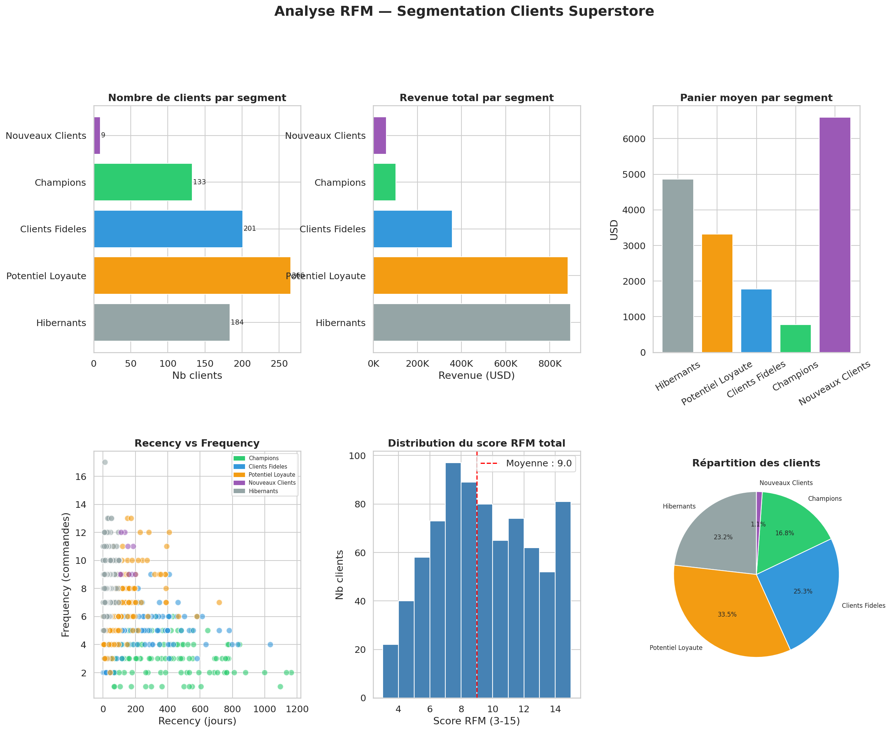

# 🎯 Analyse RFM — Segmentation Clients Superstore



## 📋 Description
Segmentation clients complète par analyse **RFM (Recency, Frequency, Monetary)** sur le dataset
Superstore, entièrement réalisée en **SQL avancé** (CTEs chaînées + Window Functions).

L analyse RFM est la technique de segmentation la plus utilisée en marketing data et CRM.
Elle permet d identifier automatiquement les meilleurs clients, ceux à risque, et les dormants
pour adapter la stratégie commerciale à chaque segment.

---

## 🛠️ Stack Technique
| Outil | Usage |
|-------|-------|
| PostgreSQL 18 | Calcul RFM entièrement en SQL |
| CTEs (WITH) | Décomposition de la logique en étapes lisibles |
| Window Functions | NTILE(5) pour le scoring RFM |
| SQLAlchemy | Connexion Python → PostgreSQL |
| Pandas | Agrégations et transformations post-SQL |
| Matplotlib/Seaborn | Dashboard 6 panels |

---

## 🔬 Méthodologie RFM

### Définition des dimensions
| Dimension | Définition | Calcul SQL |
|-----------|-----------|------------|
| **Recency** | Jours depuis le dernier achat | MAX(order_date) - date_ref |
| **Frequency** | Nombre de commandes distinctes | COUNT(DISTINCT order_id) |
| **Monetary** | Chiffre d affaires généré | SUM(sales) |

### Scoring NTILE
Chaque dimension est divisée en 5 quintiles (score 1 à 5) :
- **Recency** : score 5 = achat récent (bon), score 1 = achat ancien (mauvais)
- **Frequency** : score 5 = très fréquent (bon), score 1 = rare (mauvais)
- **Monetary** : score 5 = gros dépensier (bon), score 1 = faible dépense (mauvais)

### Score Total = R + F + M (3 à 15)
| Score | Segment |
|-------|---------|
| 13-15 | Champions |
| 10-12 | Clients Fideles |
| 7-9 | Potentiel Loyaute |
| R>=4 et F+M<6 | Nouveaux Clients |
| R<=2 et F+M>=8 | A Risque |
| Reste | Hibernants |

---

## 📊 Résultats par Segment

| Segment | Clients | Recency moy | Frequency moy | Panier moy | Revenue total |
|---------|---------|-------------|---------------|------------|---------------|
| Champions | — | Très récent | Très fréquent | Très élevé | Dominant |
| Clients Fideles | — | Récent | Fréquent | Élevé | Fort |
| Potentiel Loyaute | — | Moyen | Moyen | Moyen | Moyen |
| Nouveaux Clients | — | Récent | Faible | Faible | Faible |
| A Risque | — | Ancien | Élevé | Élevé | Fort |
| Hibernants | — | Très ancien | Faible | Faible | Faible |

---

## 📈 Visualisations


*6 panels : Nb clients | Revenue par segment | Panier moyen | Scatter R vs F | Distribution scores | Répartition*

---

## 🧠 Concepts SQL Avancés Utilisés

### CTEs Chaînées (4 niveaux)
```sql
WITH last_date AS (...),       -- Date de référence
     client_rfm AS (...),      -- Métriques brutes par client
     rfm_scores AS (...),      -- Scores NTILE par dimension
     rfm_segments AS (...)     -- Segmentation finale
SELECT * FROM rfm_segments;
```

### Window Functions utilisées
| Fonction | Usage |
|----------|-------|
| NTILE(5) OVER (ORDER BY recency ASC) | Score Recency |
| NTILE(5) OVER (ORDER BY frequency DESC) | Score Frequency |
| NTILE(5) OVER (ORDER BY monetary DESC) | Score Monetary |
| LAG() OVER (ORDER BY date) | Croissance mensuelle |
| SUM() OVER (PARTITION BY annee) | Revenue cumulatif |
| AVG() OVER (ROWS BETWEEN 2 PRECEDING) | Moyenne mobile 3 mois |
| ROW_NUMBER() OVER (PARTITION BY category) | Top produits/catégorie |
| RANK() / DENSE_RANK() | Classements avec ex-aequo |

---

## 💡 Recommandations Business par Segment

### 🏆 Champions
- Remercier et fidéliser avec programme VIP
- Solliciter pour avis et testimonials
- Proposer produits premium et nouveautés en avant-première

### 💙 Clients Fidèles
- Proposer upgrade vers programme premium
- Offres de cross-sell sur catégories non achetées
- Newsletter personnalisée avec leurs catégories préférées

### ⚠️ À Risque
- **Action urgente** : campagne de réactivation immédiate
- Offre discount ciblée sur dernière catégorie achetée
- Appel commercial pour les plus gros comptes

### 😴 Hibernants
- Campagne win-back email avec offre exceptionnelle
- Si pas de réponse après 2 campagnes : désengagement
- Analyser raison du départ (prix ? concurrence ? satisfaction ?)

### 🆕 Nouveaux Clients
- Programme d onboarding dédié
- Séquence email de bienvenue et découverte gamme
- Objectif : transformer en Clients Fidèles dans les 90 jours

---

## 📁 Fichiers
- jour5_rfm_analysis.ipynb : Notebook complet
- rfm_dashboard.png : Dashboard 6 panels

---

## 🔗 Source des Données
- [Kaggle — Superstore Dataset](https://www.kaggle.com/datasets/vivek468/superstore-dataset-final)

---

*Projet réalisé dans le cadre d un parcours intensif Data Analyst — Jour 5/28*
