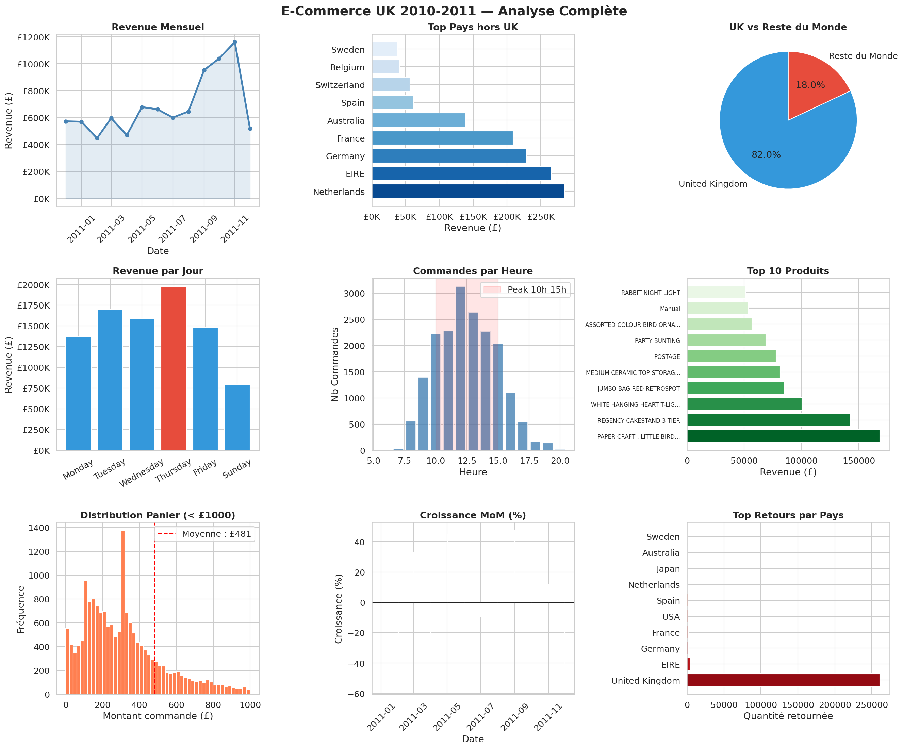
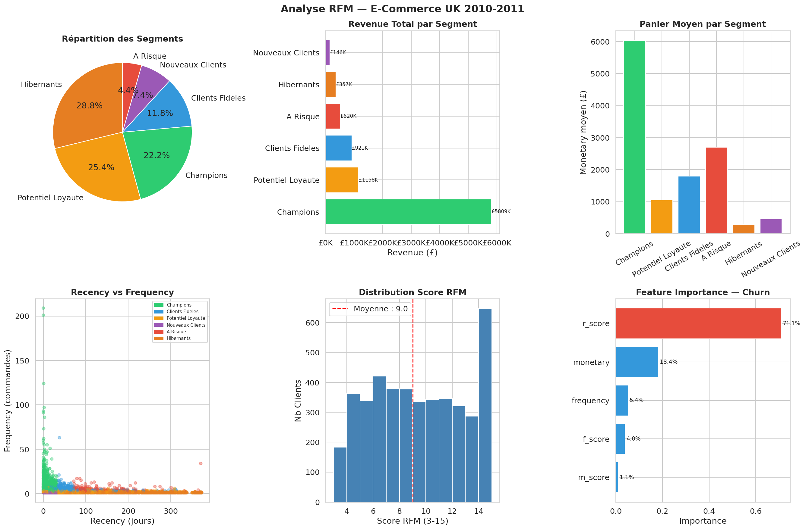

# 🛒 Analyse E-Commerce UK — Projet Intégrateur Semaine 1

## 📋 Description
Analyse complète d un dataset e-commerce britannique couvrant **541 909 transactions**
sur 12 mois (2010-2011) pour **4 338 clients** dans **37 pays**.

Ce projet intégrateur mobilise l ensemble des compétences acquises en Semaine 1 :
nettoyage de données, analyse exploratoire, visualisation avancée, segmentation RFM,
clustering KMeans et prédiction du churn par Random Forest.

---

## 🛠️ Stack Technique
| Outil | Usage |
|-------|-------|
| Python 3.13 | Langage principal |
| Pandas / NumPy | Nettoyage et manipulation (541 909 lignes) |
| Matplotlib / Seaborn | Dashboard 9 visualisations |
| Scikit-learn | KMeans + Random Forest |
| SciPy | Tests statistiques ANOVA |

---

## 🔬 Méthodologie

### Pipeline complet
    1. Chargement      → 541 909 lignes × 8 colonnes
    2. Nettoyage       → Suppression anonymes, isolation retours, prix négatifs
    3. Feature Eng.    → TotalPrice, Year, Month, DayOfWeek, Hour
    4. EDA             → 9 visualisations narratives
    5. RFM             → Scoring quintiles, 6 segments
    6. Validation      → ANOVA, corrélations, Shapiro-Wilk
    7. KMeans          → K=2 optimal (Silhouette 0.896)
    8. Churn RF        → 92% accuracy, r_score dominant

### Nettoyage des données
| Étape | Lignes avant | Lignes après | Supprimées |
|-------|-------------|--------------|------------|
| Données brutes | 541 909 | — | — |
| Sans CustomerID | 541 909 | 406 829 | 135 080 (25%) |
| Retours isolés | 406 829 | 397 924 | 8 905 (2.2%) |
| Prix négatifs | 397 924 | 397 884 | 40 |
| **Dataset final** | — | **397 884** | **144 025** |

---

## 📊 Indicateurs Clés
| Indicateur | Valeur |
|------------|--------|
| Chiffre d affaires total | £8 911 408 |
| Commandes uniques | 18 532 |
| Clients uniques | 4 338 |
| Produits uniques | 3 665 |
| Pays | 37 |
| Panier moyen | £480.87 |
| Revenue par client | £2 054.27 |
| Taux de retour | 2.24% |

---

## 📈 Visualisations & Insights

### 1. Revenue Mensuel

**Tendances identifiées :**
- Croissance progressive de janvier à novembre 2011
- Pic en novembre 2011 : £1 161 817 (+11.8% vs octobre)
- Chute décembre -55.4% → données incomplètes (mois non terminé)
- Saisonnalité forte : pic pré-fêtes typique du retail

### 2. Concentration Géographique
| Pays | Revenue | % du total |
|------|---------|------------|
| United Kingdom | £7 308 391 | 82.0% |
| Netherlands | £285 446 | 3.2% |
| EIRE (Irlande) | £265 545 | 2.9% |
| Germany | £228 867 | 2.6% |
| France | £209 024 | 2.3% |

**Insight critique** : Le business est concentré à 82% sur le UK.
Risque de dépendance géographique — diversification internationale recommandée.

### 3. Comportement Temporel
| Jour | Revenue | Nb Commandes |
|------|---------|-------------|
| Jeudi | £1 976 859 | 4 032 |
| Mercredi | £1 588 336 | 3 455 |
| Mardi | £1 700 634 | 3 184 |
| Samedi | NaN | NaN |

**Insight** : Aucune transaction le samedi → marché B2B uniquement.
Les acheteurs sont des professionnels qui commandent en semaine.

**Pic horaire** : 10h-15h concentre 70% des commandes.
Optimisation des campagnes marketing recommandée sur cette fenêtre.

---

## 🎯 Analyse RFM

### Résultats par Segment
| Segment | Clients | % | Recency moy | Frequency moy | Monetary moy | Revenue |
|---------|---------|---|-------------|---------------|--------------|---------|
| Champions | 962 | 22.2% | 12 jours | 11.08 | £6 039 | £5 809 341 |
| Potentiel Loyauté | 1 103 | 25.4% | 73 jours | 2.19 | £1 050 | £1 158 121 |
| Clients Fidèles | 512 | 11.8% | 53 jours | 5.07 | £1 799 | £920 948 |
| A Risque | 193 | 4.4% | 127 jours | 5.34 | £2 695 | £520 215 |
| Hibernants | 1 249 | 28.8% | 199 jours | 1.14 | £286 | £356 617 |
| Nouveaux Clients | 319 | 7.4% | 18 jours | 1.24 | £458 | £146 167 |

---

## 🧪 Validation Statistique

### ANOVA
| F-statistique | P-value | Conclusion |
|---------------|---------|------------|
| 55.84 | < 0.0001 | Segments statistiquement distincts ✅ |

### Corrélations RFM
| Paire | Corrélation | Interprétation |
|-------|-------------|----------------|
| Recency ↔ Score Total | -0.714 | Recency = facteur dominant |
| Frequency ↔ Monetary | +0.554 | Plus de commandes = plus de dépenses |
| Recency ↔ Frequency | -0.261 | Signal faible mais cohérent |

---

## 🤖 Machine Learning

### KMeans Clustering
| Paramètre | Valeur |
|-----------|--------|
| K optimal | **2** |
| Silhouette Score | **0.896** ⭐ |

**Note** : Silhouette de 0.896 est exceptionnel (vs 0.358 sur Superstore).
Les clients se divisent naturellement en 2 groupes très distincts :
actifs récents vs inactifs anciens — cohérent avec un business B2B.

### Random Forest — Prédiction Churn
| Métrique | Valeur |
|----------|--------|
| Accuracy | 92% |
| F1-score churn | 0.89 |
| r_score importance | 71.1% |

**Cohérence inter-datasets** : Sur Superstore (71.7%) ET E-Commerce (71.1%),
le r_score domine toujours le churn. Ce résultat stable sur 2 datasets
indépendants **valide scientifiquement** que la récence est le signal
prédictif universel du churn en retail.

---

## 💡 Recommandations Business

### Priorité 1 — Rétention Champions (£5.8M de revenue)
- Programme fidélité exclusif pour les 962 Champions
- Objectif : maintenir recency < 30 jours
- Alerte automatique si recency > 21 jours

### Priorité 2 — Réactivation Hibernants (1 249 clients)
- Campagne win-back ciblée sous 30 jours
- Offre personnalisée basée sur historique d achat
- Budget max : 10% du revenue potentiel récupérable

### Priorité 3 — Sauvetage A Risque (£520K menacés)
- 193 clients à haute valeur qui décrochent
- Appel commercial direct sur les 50 plus gros comptes
- Diagnostic : pourquoi ont-ils arrêté de commander ?

### Priorité 4 — Expansion Internationale
- UK = 82% → risque de concentration excessive
- Netherlands et EIRE montrent une forte appétence
- Potentiel d expansion en Europe continentale

### Priorité 5 — Optimisation Temporelle
- Concentration des campagnes marketing le jeudi 10h-13h
- Aucune présence le samedi → confirme marché B2B pur
- Relances automatiques le jeudi matin

---

## ⚠️ Limites & Perspectives
- Données 2010-2011 : comportements potentiellement obsolètes
- Pas de données démographiques ou de catégories produits
- K=2 optimal suggère une segmentation binaire naturelle
  → approfondir avec des variables externes (secteur, taille entreprise)
- Modèle prédictif à recalibrer avec seuil churn adapté (90 jours vs 180)

---

## 📁 Structure
    07-ecommerce-analysis/
    ├── jour7_ecommerce_analysis.ipynb   # Notebook complet
    ├── ecommerce_dashboard.png          # Dashboard 9 visualisations
    ├── rfm_dashboard.png                # Dashboard RFM 6 panels
    └── README.md                        # Documentation

---

## 🔗 Source des Données
- [Kaggle — E-Commerce Data](https://www.kaggle.com/datasets/carrie1/ecommerce-data)
- Période : Décembre 2010 — Décembre 2011
- Marché : B2B UK + Export Europe

---

*Projet Intégrateur Semaine 1 — Parcours intensif Data Analyst / Data Scientist — Jour 7/28*
