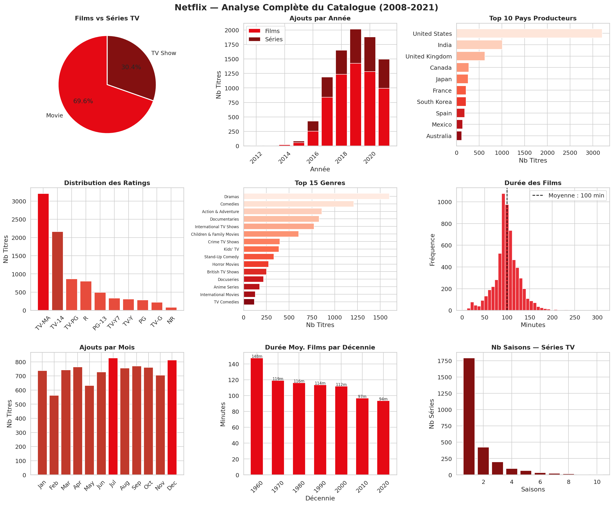
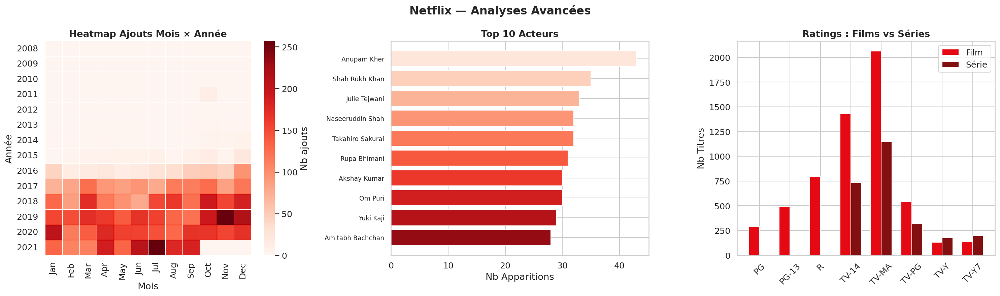

# 🎬 Analyse Netflix — Catalogue Complet 2008-2021

## 📋 Description
Analyse exploratoire complète du catalogue Netflix couvrant **8 807 titres**
(6 131 films + 2 676 séries) ajoutés entre **2008 et 2021** dans **86 pays**.

Ce projet mobilise les compétences de nettoyage, feature engineering,
visualisation avancée et analyse temporelle/géographique sur un dataset réel.

---

## 🛠️ Stack Technique
| Outil | Usage |
|-------|-------|
| Python 3.13 | Langage principal |
| Pandas / NumPy | Nettoyage, feature engineering |
| Matplotlib / Seaborn | Dashboard 9 panels + analyses avancées |

---

## 🔬 Méthodologie

### Pipeline complet
    1. Chargement      → 8 807 lignes × 12 colonnes
    2. Nettoyage       → Correction ratings mal placés, parsing dates, extraction durées
    3. Feature Eng.    → year_added, month_added, duration_min, duration_seasons,
                         country_main, genre_main, decade
    4. EDA             → 12 visualisations narratives (2 dashboards)
    5. Analyse tempo.  → Ajouts par année/mois, tendances, saisonnalité
    6. Analyse géo.    → Top pays, concentration USA/Inde
    7. Analyse contenu → Genres, ratings, durées, acteurs, réalisateurs

### Nettoyage des données
| Problème | Solution |
|----------|----------|
| 3 durées dans colonne `rating` | Déplacées vers `duration` |
| `date_added` en string | Convertie en datetime |
| `duration` mixte ("90 min" / "2 Seasons") | Séparée en `duration_min` + `duration_seasons` |
| `country` / `listed_in` multi-valeurs | Extraction du 1er élément |
| 2 634 `director` manquants (29.9%) | Conservés (NaN documenté) |

---

## 📊 Indicateurs Clés
| Indicateur | Valeur |
|------------|--------|
| Total titres | 8 807 |
| Films | 6 131 (69.6%) |
| Séries TV | 2 676 (30.4%) |
| Pays producteurs | 86 |
| Réalisateurs uniques | 4 528 |
| Genres uniques | 36 |
| Période catalogue | 1925 → 2021 |
| Période d'ajout | 2008 → 2021 |
| Durée moyenne films | 100 min |
| Saisons moyennes séries | 1.8 saisons |
| Rating dominant | TV-MA |

---

## 📈 Visualisations & Insights

### 1. Croissance du Catalogue
| Année | Total | Films | Séries |
|-------|-------|-------|--------|
| 2016 | 429 | 253 | 176 |
| 2017 | 1 188 | 839 | 349 |
| 2018 | 1 649 | 1 237 | 412 |
| 2019 | **2 016** | 1 424 | 592 |
| 2020 | 1 879 | 1 284 | 595 |
| 2021 | 1 498 | 993 | 505 |

**Insight** : Netflix a multiplié son catalogue par **~5x entre 2016 et 2019**.
Le pic de 2019 (2 016 ajouts) reflète l'apogée de la stratégie d'acquisition massive
avant la crise COVID et la pression concurrentielle (Disney+, HBO Max).

### 2. Concentration Géographique
| Pays | Titres | % |
|------|--------|---|
| United States | 3 211 | 37.6% |
| India | 1 008 | 11.8% |
| United Kingdom | 628 | 7.4% |
| Canada | 271 | 3.2% |
| Japan | 259 | 3.0% |

**Insight critique** : USA + Inde = **49.4% du catalogue**.
L'Inde représente un marché stratégique — Bollywood alimente massivement
la plateforme depuis 2018. La Corée du Sud (211 titres) confirme la montée
en puissance du K-Drama et K-Movie à l'international.

### 3. Saisonnalité des Ajouts
**Top mois** : Juillet (827), Décembre (813), Septembre (770)

**Insight** : Netflix mise sur l'été (Juillet) et les fêtes (Décembre)
pour maximiser les acquisitions d'abonnements — stratégie contenu alignée
sur les pics de consommation.

### 4. Ratings & Public Cible
| Rating | Count | Public |
|--------|-------|--------|
| TV-MA | 3 207 | Adultes (17+) |
| TV-14 | 2 160 | Ados (14+) |
| TV-PG | 863 | Guidage parental |
| R | 799 | Adultes cinéma |

**Insight** : **61% du catalogue** est classifié TV-MA ou TV-14.
Netflix cible prioritairement les adultes — cohérent avec son modèle
d'abonnement premium.

### 5. Évolution de la Durée des Films
| Décennie | Durée moy. |
|----------|-----------|
| 1960s | 147.6 min |
| 1990s | 113.8 min |
| 2010s | 96.9 min |
| 2020s | 93.6 min |

**Insight** : Les films raccourcissent structurellement (-36% en 60 ans).
La concurrence des séries et les habitudes de consommation mobile
poussent vers des formats plus courts.

### 6. Genres Dominants
**Top 5** : Dramas (1 600), Comedies (810), Action & Adventure (850),
Documentaries (829), International TV Shows (774)

**Insight** : Les Dramas dominent massivement. La catégorie
"International TV Shows" en 5e position confirme la globalisation
du contenu Netflix hors production américaine.

---

## 💡 Recommandations Business

### Priorité 1 — Diversification Géographique
- USA + Inde = 49% → risque de concentration
- Investir dans contenu Europe (FR, ES, DE) et Amérique Latine
- Le K-Drama coréen (211 titres) montre un potentiel sous-exploité

### Priorité 2 — Stratégie Contenu Court Format
- Films < 100 min = tendance 2020s confirmée
- Développer mini-séries 1 saison (68% des séries ont 1 saison)
- Aligner les budgets production sur des formats consommables mobile

### Priorité 3 — Calendrier Éditorial
- Concentrer les sorties majeures en Juillet et Décembre
- Renforcer Janvier (creux post-fêtes) pour fidéliser les abonnés
- Septembre/Octobre = fenêtre stratégique pré-fêtes

### Priorité 4 — Transparence Réalisateurs
- 29.9% de `director` manquants = problème de metadata
- Enrichissement de la base indispensable pour la recommandation

---

## ⚠️ Limites & Perspectives
- Dataset arrêté en 2021 : catalogue actuel très différent post-2022
- Pas de données de visionnage (vues, durée de watch, ratings utilisateurs)
- `country` multi-valeurs : co-productions sous-représentées
- Analyse NLP des descriptions (`description`) non réalisée → piste jour 9

---

## 📁 Structure
    08-netflix-analysis/
    ├── jour8_netflix_eda.ipynb      # Notebook complet (10 cellules)
    ├── netflix_dashboard.png        # Dashboard 9 panels
    ├── netflix_advanced.png         # Heatmap + acteurs + ratings
    ├── images/                      # Dossier visuels complémentaires
    └── README.md                    # Documentation

---

## 🔗 Source des Données
- [Kaggle — Netflix Movies and TV Shows](https://www.kaggle.com/datasets/shivamb/netflix-shows)
- Licence : CC0 1.0 (Domaine Public)
- Couverture : 2008 → 2021

---

*Jour 8/28 — Parcours intensif Data Analyst — Révision EDA Complet*
