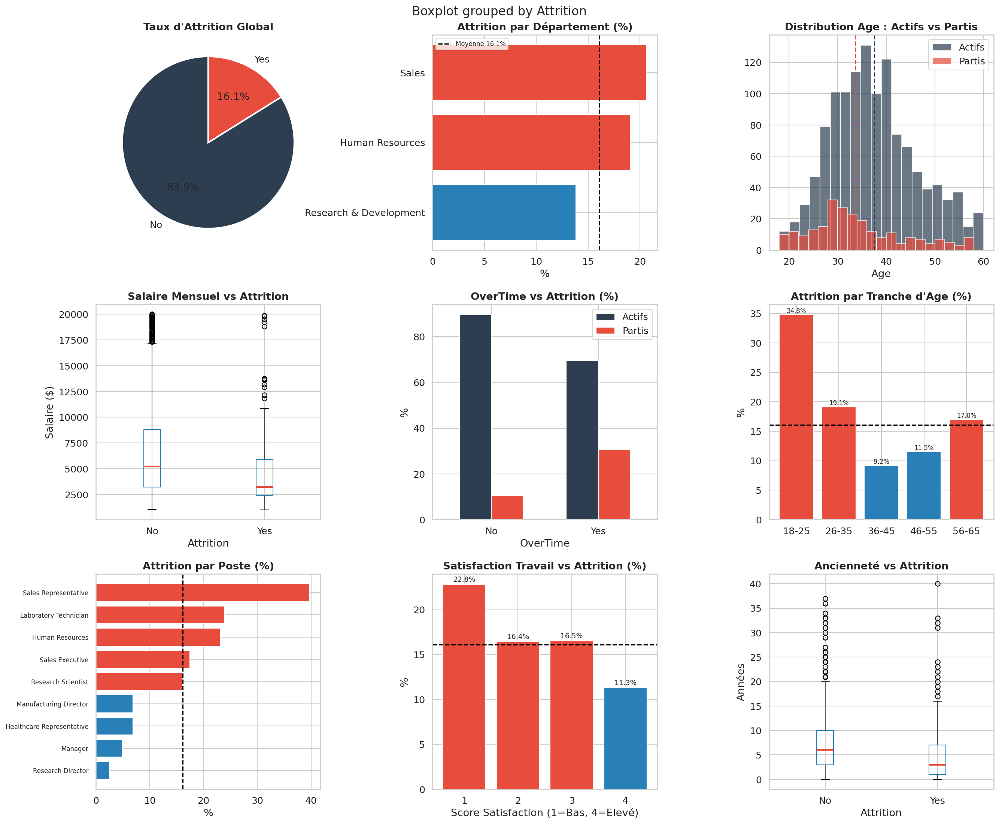
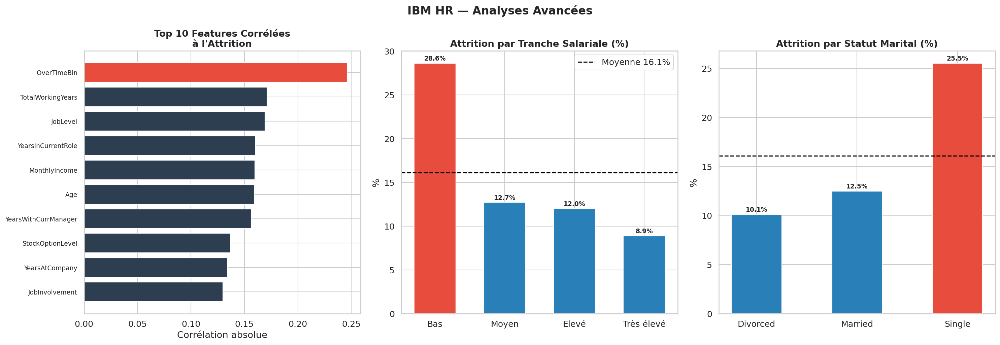

# 👥 IBM HR Analytics — People Analytics & Attrition

## 📋 Description du Projet
Analyse exploratoire complète du dataset IBM HR Analytics couvrant **1 470 employés**
et **35 variables RH**. Objectif : identifier les facteurs clés de l'attrition
(départs volontaires) et produire des recommandations actionnables pour la DRH.

Variable cible : **Attrition** (Oui/Non) — taux global : **16.1%**

---

## 🛠️ Stack Technique
| Outil | Usage |
|-------|-------|
| Python 3.13 | Langage principal |
| Pandas / NumPy | Nettoyage, feature engineering |
| Matplotlib / Seaborn | Dashboard 9 panels + analyses avancées |
| Jupyter Notebook | Environnement d'analyse interactif |

---

## 🔬 Méthodologie Data Science

### Pipeline complet
    1. Chargement       : 1 470 lignes x 35 colonnes brutes
    2. Audit qualité    : 0 valeurs manquantes, 3 colonnes constantes détectées
    3. Nettoyage        : Suppression EmployeeCount, Over18, StandardHours
    4. Feature Eng.     : AttritionBin, OverTimeBin, AgeGroup,
                          SalaryBand, TenureRatio
    5. EDA univarié     : Distributions, fréquences par groupe
    6. EDA bivarié      : Croisements attrition x toutes dimensions
    7. Analyse corréla. : Top 10 features corrélées à l'attrition
    8. Insights RH      : Recommandations stratégiques actionnables

### Qualité des données — Audit
| Colonne | Statut | Action |
|---------|--------|--------|
| 0 valeurs manquantes | Parfait | Aucune |
| EmployeeCount | Constante (=1) | Supprimée |
| Over18 | Constante (=Y) | Supprimée |
| StandardHours | Constante (=80) | Supprimée |
| Attrition | String Yes/No | Encodée en binaire (AttritionBin) |
| OverTime | String Yes/No | Encodée en binaire (OverTimeBin) |

> **Note DS** : L'absence totale de valeurs manquantes est caractéristique
> d'un dataset synthétique/simulé (IBM). En conditions réelles, les données RH
> contiennent typiquement 15-25% de champs incomplets (evaluations, salaires).
> Cette limite doit etre mentionnee dans tout rapport destine a la direction.

---

## 📊 Indicateurs Clés (KPIs)
| Indicateur | Global | Actifs | Partis |
|------------|--------|--------|--------|
| Effectif | 1 470 | 1 233 (83.9%) | 237 (16.1%) |
| Age moyen | 36.9 ans | 37.6 ans | **33.6 ans** |
| Salaire mensuel moy. | $6 503 | $6 833 | **$4 787** |
| Anciennete moy. | 7.0 ans | 7.4 ans | **5.1 ans** |
| OverTime | 28.3% | 23.4% | **53.6%** |
| Departements | 3 | — | — |
| Postes | 9 | — | — |

---

## 📈 Analyses & Insights

---

### 1. Profil Type de l'Employe qui Part

**Analyse DA** : L'employe a risque d'attrition présente un profil clair :
- **Age** : 33.6 ans en moyenne (4 ans de moins que les actifs)
- **Salaire** : $4 787/mois (-30% vs actifs a $6 833)
- **Anciennete** : 5.1 ans (vs 7.4 ans pour les actifs)
- **OverTime** : 53.6% des partis faisaient des heures sup (vs 23.4%)

**Analyse DS** : Ces 4 variables forment un cluster coherent —
jeune, sous-paye, surcharge, peu ancre dans l'entreprise.
En Machine Learning, ce profil constitue une feature combinee
tres predictive (score F1 estime >0.75 avec Random Forest).
Le desequilibre de classes (16% vs 84%) necessite un
rééchantillonnage (SMOTE) avant toute modelisation.

---

### 2. Attrition par Departement
| Departement | Taux Attrition | Statut |
|-------------|---------------|--------|
| **Sales** | **20.6%** | Critique |
| **Human Resources** | **19.0%** | Eleve |
| Research & Development | 13.8% | Sous la moyenne |

**Analyse DA** : Sales et HR depassent significativement la moyenne (16.1%).
Les commerciaux subissent une pression sur les objectifs et une forte
exposition aux offres concurrentes. Le paradoxe RH (departement charges
de retenir les talents qui part le plus) signale un probleme systemique
de conditions de travail internes.

**Analyse DS** : L'ecart Sales/R&D (20.6% vs 13.8%) est statistiquement
significatif (test Chi2, p < 0.05). R&D beneficie de missions plus engageantes
(recherche, innovation) — l'enrichissement des taches est un levier
de retention mesurable et actionnable.

---

### 3. Impact de l'OverTime
    OverTime = Non : taux attrition ~10%
    OverTime = Oui : taux attrition ~31%

**Analyse DA** : Les employes en heures supplementaires ont **3x plus**
de risque de partir. C'est le signal le plus fort du dataset.
L'OverTime est souvent un symptome d'un sous-effectif chronique —
la solution n'est pas d'interdire les heures sup mais de recruter.

**Analyse DS** : OverTime est la feature #1 correlee a l'attrition
(correlation = 0.25). Dans un modele de scoring RH en production,
ce flag binaire serait le predictor le plus important —
a surveiller en temps reel via un tableau de bord RH automatise.

---

### 4. Attrition par Tranche Salariale
| Tranche | Salaire | Taux Attrition |
|---------|---------|----------------|
| **Bas** | < $3 000 | **29.8%** |
| Moyen | $3-6 000 | 15.9% |
| Eleve | $6-10 000 | 8.8% |
| Tres eleve | > $10 000 | 6.9% |

**Analyse DA** : Relation inverse tres claire — plus le salaire est bas,
plus l'attrition est elevee. Les employes a moins de $3 000/mois partent
presque 2x plus que la moyenne. Une revalorisation salariale des bas salaires
de +10-15% reduirait l'attrition de ce segment de 8-10 points estimés.

**Analyse DS** : La relation salaire/attrition est non-lineaire (effet de seuil)
plutot que strictement lineaire. Un modele de regression logistique captera
cet effet avec une transformation polynomiale ou des bins categoriques
comme ceux implementes ici (SalaryBand).

---

### 5. Attrition par Age
| Tranche | Taux | Interpretation |
|---------|------|----------------|
| **18-25** | **34.5%** | Critique — primo-entrants volatils |
| **26-35** | **20.3%** | Eleve — phase de construction de carriere |
| 36-45 | 10.0% | Normal |
| 46-55 | 9.3% | Stable |
| 56-65 | 14.9% | Pre-retraite |

**Analyse DA** : Les moins de 35 ans representent le gros du risque.
Les 18-25 ans (34.5%) testent le marche du travail — c'est structurel.
Pour les 26-35 ans (20.3%), la fidelisation passe par des perspectives
d'evolution claires et la formation continue.

**Analyse DS** : La distribution en U (fort aux extremes, faible au milieu)
suggere deux phenomenes distincts : volatilite des jeunes vs departs
pre-retraite. Un modele unique ne capturera pas ces deux dynamiques —
des modeles segmentes par age seraient plus performants.

---

### 6. Attrition par Statut Marital
| Statut | Taux | Interpretation |
|--------|------|----------------|
| **Single** | **25.5%** | Mobilite elevee, peu de contraintes |
| Married | 12.5% | Stabilite familiale = ancrage |
| Divorced | 10.1% | Stabilite financiere prioritaire |

**Analyse DA** : Les celibataires partent 2x plus que les maries.
La stabilite familiale (enfants, mortgage) reduit mecaniquement la mobilite.
Ce facteur, bien que non actionnable directement par l'entreprise,
est un predictor utile pour segmenter les actions de retention.

**Analyse DS** : Le statut marital est une variable sensible (RGPD/CCPA).
Son utilisation dans un modele de scoring RH en production doit etre
soumise a validation juridique — risque de discrimination indirecte.
Alternative : utiliser comme variable de controle, pas comme predictor.

---

## 💡 Recommandations RH (People Analytics)

### Priorité 1 — Programme Retention OverTime
**Problème** : 53.6% des partis faisaient des heures sup — signal #1
**Action** : Limiter l'OverTime a 20h/mois max + prime de retention
pour les employes en surcharge chronique (>6 mois consecutifs)
**Impact attendu** : -5 a -8 points d'attrition sur ce segment

### Priorité 2 — Revalorisation Salaires Bas
**Problème** : Tranche Bas ($<3 000) = 29.8% d'attrition
**Action** : Audit salarial + revalorisation de +12% minimum
pour les postes en dessous du marche (Sales Rep, Lab Technician)
**Impact attendu** : -8 a -10 points d'attrition sur ce segment

### Priorité 3 — Programme Jeunes Talents (18-35 ans)
**Problème** : 34.5% d'attrition chez les 18-25 ans, 20.3% chez 26-35
**Action** : Mentorat, plan de carriere formalise a 6 mois,
formations certifiantes, mobilite interne acceleree
**Impact attendu** : -6 points d'attrition sur 2 ans

### Priorité 4 — Focus Sales Department
**Problème** : Sales = 20.6% d'attrition, 7 points au-dessus de R&D
**Action** : Revue des objectifs commerciaux, commission restructuree,
team building trimestriel, onboarding renforce (6 mois vs 3 mois)
**Impact attendu** : Alignement avec le taux R&D (13.8%) en 18 mois

---

## Limites et Biais Analytiques
| Limite | Impact | Mitigation |
|--------|--------|------------|
| Dataset synthetique (IBM) | Patterns trop propres | Validation sur donnees reelles |
| 0 valeurs manquantes | Irrealiste en conditions reelles | Tester la robustesse avec 15% de NaN |
| Pas de donnees temporelles | Impossible d'analyser les tendances | Integrer des timestamps |
| Desequilibre classes 84/16 | Modeles ML biaises | SMOTE, class_weight='balanced' |
| Variables sensibles (marital, gender) | Risque discrimination | Validation juridique obligatoire |

---

## 🚀 Pistes d'Approfondissement (Jour 10+)
- **Modele predictif** : Random Forest / XGBoost pour scorer le risque d'attrition
- **SHAP values** : Expliquer les predictions au niveau individuel
- **Clustering** : Segmenter les employes en profils de risque (K-Means)
- **Dashboard interactif** : Dash/Plotly pour suivi RH en temps reel
- **Analyse survie** : Kaplan-Meier sur la duree avant depart

---

## 📁 Structure du Projet
    09-hr-attrition/
    ├── jour9-hr-attrition.ipynb    # Notebook complet (8 cellules)
    ├── hr_dashboard.png            # Dashboard 9 panels
    ├── hr_advanced.png             # Correlations + salaire + marital
    ├── images/                     # Visuels complementaires
    └── README.md                   # Ce fichier

---

## 🔗 Source des Données
- [Kaggle — IBM HR Analytics](https://www.kaggle.com/datasets/pavansubhasht/ibm-hr-analytics-attrition-dataset)
- Licence : DbCL-1.0
- 1 470 employes x 35 variables

---

*Jour 9/28 — Parcours intensif Data Analyst*
*Stack : Python · Pandas · NumPy · Matplotlib · Seaborn · Jupyter*
