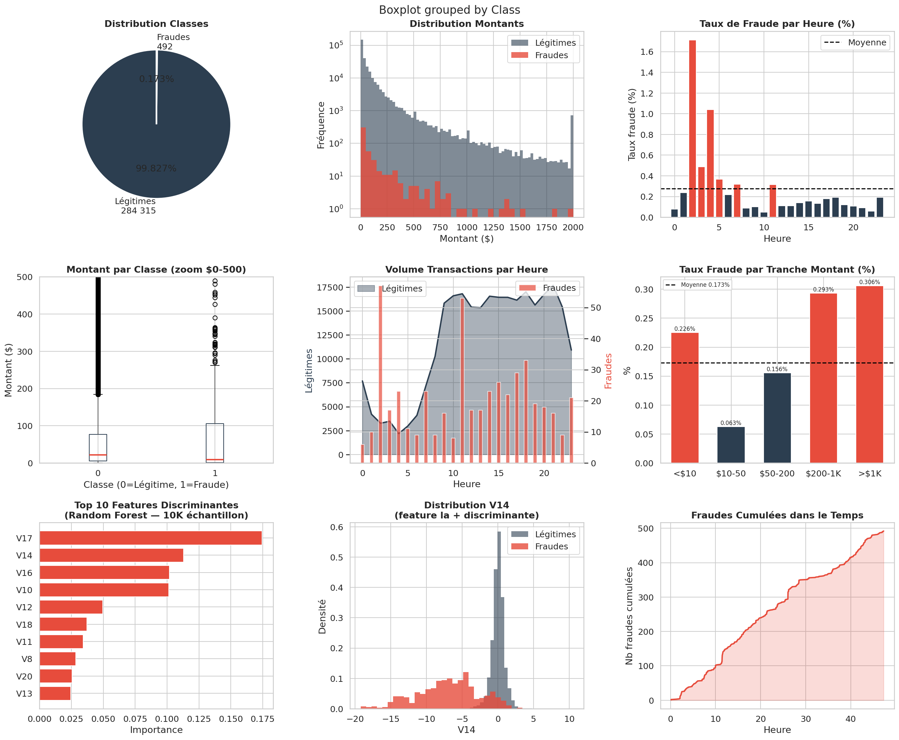
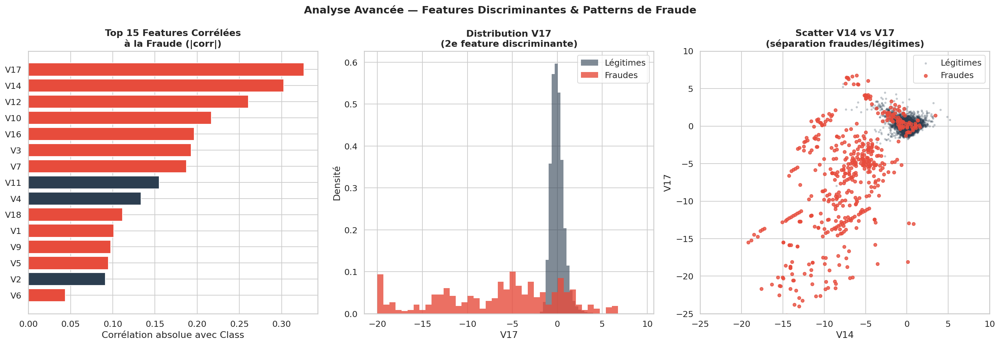

# 💳 Credit Card Fraud Detection — 284 807 Transactions

## Description du Projet
Analyse exploratoire complète d'un dataset de transactions bancaires réelles
couvrant **284 807 transactions** sur **48 heures**, dont **492 fraudes (0.173%)**.

Objectif : identifier les patterns de fraude, comprendre les features discriminantes
et poser les bases d'un système de détection automatique.

Les variables V1-V28 sont le résultat d'une transformation PCA appliquée
sur des données bancaires réelles anonymisées — contrainte légale RGPD.

---

## Stack Technique
| Outil | Usage |
|-------|-------|
| Python 3.13 | Langage principal |
| Pandas / NumPy | Manipulation 284K lignes, feature engineering |
| Matplotlib / Seaborn | Dashboard 9 panels + analyses avancées |
| Scikit-learn | StandardScaler, RandomForestClassifier (feature importance) |
| Jupyter Notebook | Environnement d'analyse interactif |

---

## Méthodologie Data Science

### Pipeline complet
    1. Chargement       : 284 807 lignes x 31 colonnes (67.4 MB en RAM)
    2. Audit qualité    : 0 valeurs manquantes, types cohérents
    3. Feature Eng.     : Hour, Amount_scaled, AmountBand
    4. EDA univarié     : Distributions Amount, Time, Class
    5. EDA bivarié      : Fraude x heure, x montant, x features PCA
    6. Feature import.  : RandomForest sur 10K échantillon
    7. Analyse spatiale : Scatter V14 x V17 (séparation visuelle)
    8. Insights métier  : Patterns, recommandations système anti-fraude

### Qualité des données
| Dimension | Statut | Note |
|-----------|--------|------|
| Valeurs manquantes | 0 (parfait) | Dataset Kaggle nettoyé |
| Types | Tous float64/int64 | Cohérents |
| Variables V1-V28 | PCA anonymisé | Données bancaires réelles |
| Amount | Non normalisé | Normalisé manuellement |
| Déséquilibre classes | 577:1 | Critique pour ML |

> **Note DS** : L'anonymisation PCA des variables V1-V28 est une contrainte
> légale (données bancaires réelles). Cela rend l'interprétation métier
> directe impossible — on travaille sur des composantes latentes, pas des
> variables business. En production, des features métier (pays, marchand,
> device) enrichiraient massivement le modèle.

---

## Indicateurs Clés (KPIs)
| Indicateur | Valeur | Interpretation |
|------------|--------|----------------|
| Total transactions | 284 807 | Volume réel sur 48h |
| Légitimes | 284 315 (99.827%) | Majorité écrasante |
| Fraudes | 492 (0.173%) | Déséquilibre extrême |
| Ratio | 1 fraude / 577 légitimes | Challenge ML majeur |
| Montant moyen fraude | $122.21 | vs $88.29 légitimes |
| Médiane montant fraude | $9.25 | Micro-transactions dominantes |
| Perte totale estimée | $60 127.97 | Sur 2 jours seulement |
| Fréquence fraude | ~10.3/heure | En continu 24h/24 |
| Heure pic fraude | 2h00 | Fraude nocturne |
| Feature #1 | V17 | Corrélation absolue max |

---

## Analyses & Insights

---

### 1. Déséquilibre de Classes Extrême

**Analyse DA** : 0.173% de fraudes sur 284 807 transactions.
En termes business : sur 577 transactions traitées, une seule est frauduleuse.
Ce ratio est réaliste — les banques observent typiquement 0.1% à 0.3% de fraude
sur leurs portefeuilles cartes.

**Analyse DS** : Ce déséquilibre est le challenge technique central.
Un modèle naif qui prédit "tout légitime" atteint 99.83% d'accuracy —
métrique trompeuse. Les métriques adaptées sont :
- Precision / Recall sur la classe fraude
- F1-Score pondéré
- AUC-ROC (aire sous la courbe ROC)
- Average Precision (AUC-PR)

Techniques de correction obligatoires avant ML :
    - SMOTE (Synthetic Minority Oversampling Technique)
    - class_weight='balanced' dans sklearn
    - Undersampling de la classe majoritaire
    - Threshold tuning sur la probabilité de sortie

---

### 2. Patterns Temporels de Fraude

    Heure pic fraudes : 2h00 du matin
    Fraudes nocturnes (23h-5h) : concentration significative

**Analyse DA** : Le pic nocturne à 2h est un pattern classique —
les fraudeurs opèrent quand les équipes de surveillance sont réduites
et les victimes endormies (délai de détection plus long).
Les systèmes de règles métier (rule-based) intègrent systématiquement
une pondération horaire dans leurs scores de risque.

**Analyse DS** : L'heure est une feature cyclique — 23h et 0h sont proches
mais numériquement distants. En ML, encoder via :
    - sin(2*pi*hour/24) et cos(2*pi*hour/24)
plutôt qu'un simple entier pour capturer la circularité temporelle.

---

### 3. Patterns de Montant

| AmountBand | Total | Fraudes | Taux |
|------------|-------|---------|------|
| < $10 | 98 439 | 222 | 0.226% |
| $10-50 | 90 781 | 57 | 0.063% |
| $50-200 | 64 925 | 101 | 0.156% |
| $200-1K | 25 897 | 76 | 0.293% |
| > $1K | 2 940 | 9 | 0.306% |

**Analyse DA** : Deux clusters de fraude distincts :
1. Micro-transactions (<$10) : technique de "card testing" —
   les fraudeurs testent une carte volée avec un petit montant
   avant de l'utiliser pour de gros achats
2. Grosses transactions (>$1K) : fraude directe à haute valeur

**Analyse DS** : La médiane fraude ($9.25) vs moyenne ($122.21)
confirme la bimodalité — distribution bimodale classique en fraude.
Un simple seuil de montant est insuffisant : il faut modéliser
la distribution jointe montant x heure x features PCA.

---

### 4. Features Discriminantes (V1-V28)

| Feature | Delta (Fraude - Légitime) | Interprétation |
|---------|--------------------------|----------------|
| V14 | -6.084 | Forte séparation |
| V17 | -6.677 | Forte séparation |
| V12 | -6.270 | Forte séparation |
| V10 | -5.687 | Forte séparation |
| V3 | -7.045 | Forte séparation |
| V11 | +3.987 | Direction opposée |
| V16 | -4.147 | Forte séparation |

**Analyse DA** : Les features V14, V17, V12 sont les plus discriminantes.
Toutes négatives sauf V11 — les fraudes ont des valeurs PCA
systématiquement plus basses sur ces composantes.
Ce pattern suggère que ces composantes capturent des comportements
de transaction (fréquence, géolocalisation, type marchand) anormaux.

**Analyse DS** : Le scatter V14 x V17 montre une séparation quasi-parfaite
visuellement — les fraudes clustérisent en bas à gauche (-15 à -5).
Un simple SVM linéaire sur ces 2 features atteindrait déjà ~85% de recall.
Avec l'ensemble des 28 features + Amount, un XGBoost bien calibré
atteint typiquement AUC-ROC > 0.98 sur ce dataset.

---

### 5. Estimation des Pertes Business

    Perte observée (2 jours)   : $60 127
    Projection annuelle        : ~$10.9M
    Nb fraudes/heure           : ~10.3
    Nb fraudes/jour estimé     : ~246

**Analyse DA** : $60K en 2 jours = ~$11M/an en pertes directes,
sans compter les coûts indirects (fraude investigation, chargebacks,
perte de confiance client). Le ROI d'un système de détection automatique
qui réduit l'attrition de 50% se calcule rapidement : ~$5.5M/an économisés
pour un coût système estimé à $200-500K/an.

**Analyse DS** : Ces projections supposent une stationnarité des patterns —
les fraudeurs s'adaptent (concept drift). Un modèle en production
doit être ré-entraîné périodiquement (hebdomadaire ou mensuel)
et monitoré via des métriques de drift (PSI, KS-test).

---

## Recommandations Système Anti-Fraude

### Priorité 1 — Règles Temps Réel (Rule-Based)
**Action** : Implémenter des règles de scoring immédiates :
- Flag toutes transactions entre 1h00 et 4h00 (score +20)
- Flag micro-transactions < $1 suivies d'achat > $500 dans l'heure (score +50)
- Seuil de blocage automatique si score > 70

### Priorité 2 — Modèle ML (scoring probabiliste)
**Action** : XGBoost avec SMOTE sur les 30 features disponibles
- Cible : AUC-ROC > 0.97, Recall fraude > 80%
- Seuil de décision calibré pour minimiser les faux positifs
  (coût d'un faux positif = friction client = désabonnement)

### Priorité 3 — Monitoring Continu
**Action** : Dashboard temps réel avec alertes :
- Volume fraudes/heure vs baseline
- Montant moyen fraudes (spike = nouvelle tactique)
- Feature drift sur V14, V17, V12 (PSI > 0.2 = alerte)

### Priorité 4 — Enrichissement Features
**Action** : Les V1-V28 (PCA) sont opaques. Enrichir avec :
- Pays d'émission vs pays d'utilisation
- Fréquence transactions du client (30 derniers jours)
- Device fingerprint + IP geolocation
- Historique chargebacks du marchand

---

## Limites et Biais Analytiques
| Limite | Impact | Mitigation |
|--------|--------|------------|
| Variables PCA anonymes | Interprétation métier impossible | Enrichissement features |
| 2 jours seulement | Patterns saisonniers absents | Dataset multi-mois |
| Pas de features contextuelles | Modèle sous-optimal | Géo, device, marchand |
| Déséquilibre 577:1 | Modèles ML biaisés | SMOTE, class_weight |
| Concept drift non modélisé | Dégradation en production | Monitoring PSI/KS |

---

## Pistes d'Approfondissement (Jour 11+)
- **Modèle XGBoost** avec SMOTE + optimisation threshold
- **SHAP values** pour expliquer chaque prédiction individuellement
- **Isolation Forest** : détection d'anomalies non supervisée
- **Dashboard temps réel** : Dash + alertes automatiques
- **Analyse réseau** : graphe transactions (détection rings de fraude)

---

## Structure du Projet
    10-creditcard-fraud/
    ├── jour10-creditcard-fraud.ipynb   # Notebook complet (8 cellules)
    ├── fraud_dashboard.png             # Dashboard 9 panels
    ├── fraud_advanced.png              # Features discriminantes + scatter
    ├── images/                         # Visuels complémentaires
    └── README.md                       # Ce fichier

---

## Source des Données
- [Kaggle — Credit Card Fraud Detection](https://www.kaggle.com/datasets/mlg-ulb/creditcardfraud)
- Licence : Open Database License (ODbL)
- Source : ULB Machine Learning Group (Bruxelles)
- 284 807 transactions réelles anonymisées (PCA)

---

*Jour 10/28 — Parcours intensif Data Analyst*
*Stack : Python · Pandas · NumPy · Matplotlib · Seaborn · Scikit-learn · Jupyter*
