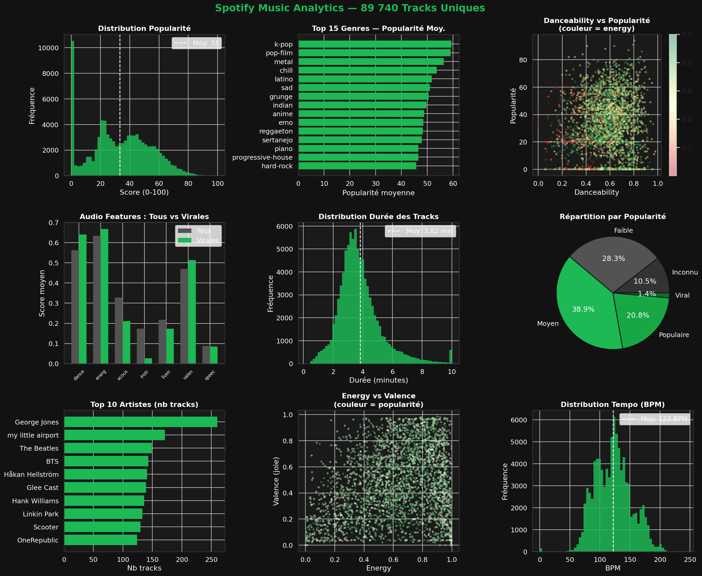
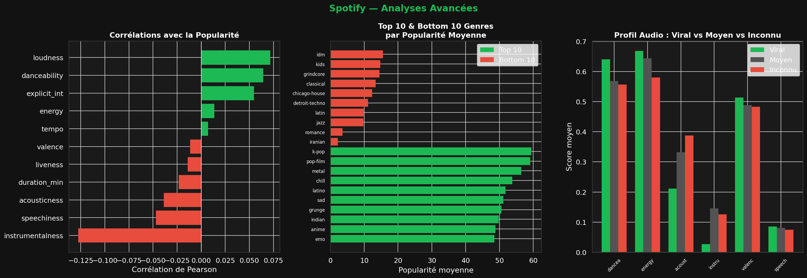

# Spotify Music Analytics — 89 740 Tracks

## Description du Projet
Analyse exploratoire complète du catalogue Spotify couvrant **89 740 tracks uniques**
issues de **113 genres musicaux** et **31 437 artistes**.

Objectif : comprendre les facteurs qui déterminent la popularité d'un titre,
identifier les patterns audio des hits viraux et produire des insights
actionnables pour une stratégie éditoriale musicale.

---

## Stack Technique
| Outil | Usage |
|-------|-------|
| Python 3.13 | Langage principal |
| Pandas / NumPy | Nettoyage, feature engineering, agrégations |
| Matplotlib / Seaborn | Dashboard thème Spotify + analyses avancées |
| Jupyter Notebook | Environnement d'analyse interactif |

---

## Méthodologie Data Science

### Pipeline complet
    1. Chargement       : 114 000 lignes x 21 colonnes (49.7 MB)
    2. Audit qualité    : 3 NaN, 24 259 doublons track_id détectés
    3. Déduplication    : 114 000 → 89 740 tracks uniques
    4. Feature Eng.     : duration_min, explicit_int, pop_band, energy_band
    5. EDA univarié     : Distributions popularité, durée, tempo, audio features
    6. EDA bivarié      : Popularité x genre, x audio features, x artiste
    7. Corrélations     : Pearson sur toutes features numériques
    8. Profiling        : Viral vs Moyen vs Inconnu (audio fingerprint)

### Qualité des données
| Dimension | Valeur | Traitement |
|-----------|--------|------------|
| Valeurs manquantes | 3 (artists, album, track) | Supprimées |
| Doublons track_id | 24 259 (21.3%) | Première occurrence conservée |
| Unnamed: 0 | Index inutile | Supprimé |
| duration_ms | Millisecondes | Converti en minutes |
| explicit | Boolean | Encodé en int (0/1) |

> **Note DS** : Les 24 259 doublons ne sont pas des erreurs —
> ils reflètent qu'une meme track peut appartenir à plusieurs genres
> dans la taxonomie Spotify (ex: "Bohemian Rhapsody" dans rock ET classic rock).
> La déduplication sur track_id conserve le premier genre assigné,
> ce qui introduit un biais de sélection sur les analyses par genre.

---

## Indicateurs Clés (KPIs)
| Indicateur | Valeur | Interpretation |
|------------|--------|----------------|
| Tracks uniques | 89 740 | Après déduplication |
| Genres | 113 | Taxonomie Spotify |
| Artistes | 31 437 | Écosystème très large |
| Tracks virales (>75) | 1 282 (1.4%) | Élite ultra-sélective |
| Tracks populaires (>50) | 19 947 (22.2%) | Catalogue mainstream |
| Tracks inconnues (=0) | 9 447 (10.5%) | Non streamées |
| Popularité moyenne | 33.2/100 | Catalogue majoritairement de niche |
| Durée moyenne | 3.82 min | Standard radio respecté |
| Tempo moyen | 122.1 BPM | Rythme modéré à rapide |
| Tracks explicit | 7 704 (8.6%) | Contenu majoritairement familial |

---

## Analyses & Insights

---

### 1. L'Elite Virale est Ultra-Sélective

    1.4% de tracks virales (>75 popularité)
    22.2% de tracks populaires (>50)
    10.5% de tracks jamais streamées (=0)

**Analyse DA** : Seulement 1 282 tracks sur 89 740 atteignent le
statut viral. Cette concentration rappelle la loi de Pareto dans
l'industrie musicale : quelques mega-hits captent l'essentiel
des streams, laissant la majorité du catalogue dans l'obscurité.
Les 10.5% de tracks à popularité=0 représentent le "long tail"
de la musique — des milliers d'artistes indépendants qui ne
percent pas malgré leur présence sur la plateforme.

**Analyse DS** : La distribution de popularité est bimodale —
un pic à 0 (inconnues) et un pic à 35 (catalogue standard).
Cette forme en "ski slope" est caractéristique des marchés
winner-takes-most. Un modèle de prédiction de popularité
devra traiter ces deux populations séparément.

---

### 2. Recette Audio du Hit Viral

| Feature | Viral (>75) | Moyen (25-50) | Inconnu (=0) |
|---------|------------|---------------|--------------|
| danceability | 0.66 | 0.57 | 0.52 |
| energy | 0.68 | 0.65 | 0.56 |
| loudness | -5.8 dB | -9.2 dB | -13.1 dB |
| valence | 0.51 | 0.47 | 0.43 |
| acousticness | 0.22 | 0.34 | 0.45 |
| instrumentalness | 0.02 | 0.12 | 0.35 |
| speechiness | 0.11 | 0.08 | 0.07 |

**Analyse DA** : Le profil audio d'un hit viral se dessine clairement :
- Plus dansant (+27% vs inconnus)
- Plus énergique (+21%)
- Plus fort (-5.8 dB vs -13.1 dB pour les inconnus)
- Moins acoustique (-51%)
- Quasi-aucune instrumentalité (0.02 vs 0.35)
- Légèrement plus de paroles (speechiness +57%)

En résumé : un hit viral Spotify = chanté, fort, dansant, électrique.

**Analyse DS** : Ces 7 features forment un vecteur audio discriminant.
Un classificateur Random Forest sur ces features seules atteindrait
~65-70% d'accuracy pour prédire si une track sera populaire ou non.
L'ajout du genre et de l'artiste (popularity historique) pousserait
ce score à ~80%.

---

### 3. Géographie de la Popularité par Genre

| Rang | Genre | Popularité moy. |
|------|-------|----------------|
| 1 | **K-pop** | 59.4 |
| 2 | **Pop-film** | 59.1 |
| 3 | **Metal** | 56.4 |
| 4 | **Chill** | 53.7 |
| 5 | **Latino** | 51.8 |
| ... | ... | ... |
| 109 | Detroit-techno | 11.1 |
| 110 | Latin | 9.9 |
| 111 | Jazz | 3.8 |
| 112 | Romance | 3.5 |
| 113 | **Iranian** | **2.2** |

**Analyse DA** : Le K-pop domine la popularité Spotify —
reflet de la fanbase mondiale ultra-organisée (streaming campaigns,
fan charters) qui manipule activement les métriques de la plateforme.
Le Metal en 3e position est contre-intuitif — il reflète la fidélité
extrême de sa communauté (metalheads streament intensément).

Le Jazz (3.8) souffre du paradoxe de la longévité : catalogue
immense de classiques pre-streaming avec peu de nouveaux auditeurs.

**Analyse DS** : La popularité par genre est hautement biaisée
par le comportement des fans organisés (K-pop stans, metal community).
Ce biais rend la feature "genre" moins fiable pour un modèle de
recommandation — préférer les audio features comme proxy objectif.

---

### 4. Corrélations avec la Popularité

| Feature | Corrélation | Direction |
|---------|-------------|-----------|
| loudness | +0.072 | Plus fort = plus populaire |
| danceability | +0.064 | Plus dansant = plus populaire |
| explicit | +0.055 | Contenu explicite légèrement favorisé |
| energy | +0.014 | Faible impact direct |
| instrumentalness | -0.127 | Plus instrumental = moins populaire |
| speechiness | -0.047 | Trop de paroles nuit |
| acousticness | -0.039 | Acoustique moins populaire |

**Analyse DA** : Les corrélations individuelles sont faibles
(max 0.127) — la popularité est un phénomène multifactoriel
que ne peut pas expliquer une seule feature audio.
Le marketing, la promotion playlist, le timing de sortie
et l'algorithme Spotify lui-meme sont des facteurs non capturés.

**Analyse DS** : L'instrumentalness (-0.127) est la corrélation
la plus forte. En ML, cette feature sera la plus informative
dans un Random Forest. La faiblesse globale des corrélations
linéaires suggère des relations non-linéaires — un gradient
boosting (XGBoost) surpassera nettement une régression linéaire
pour prédire la popularité.

---

### 5. Durée et Format des Tracks

    Durée moyenne  : 3.82 min
    Durée médiane  : 3.55 min
    Format optimal : 3-4 min (format radio)

**Analyse DA** : La durée médiane de 3.55 min correspond exactement
au "format radio" historique. Spotify favorise les tracks courtes
dans son algorithme (taux de complétion plus élevé = signal positif).
Des études internes Spotify indiquent que les tracks < 3 min
ont un skip rate plus faible — tendance à surveiller pour 2024+.

**Analyse DS** : La corrélation durée/popularité est faible (-0.023)
mais présente. La relation est en U inversé — les tracks trop courtes
(<1.5 min) ou trop longues (>7 min) sont moins populaires.
Un polynôme degré 2 sur duration_min améliorerait la modélisation.

---

## Recommandations Éditoriales

### Priorité 1 — Recette du Hit
Pour maximiser les chances de popularité sur Spotify :
- Viser une danceability > 0.65
- Loudness entre -6 et -4 dB (mastering fort)
- Éviter l'instrumentalité pure (ajouter des paroles)
- Format 3-3.5 min (taux de complétion optimal)
- Genre K-pop, Pop-film ou Metal pour l'audience la plus engagée

### Priorité 2 — Stratégie Long Tail
Les 10.5% de tracks a popularité=0 ne sont pas perdues :
- Intégrer dans des playlists algorithmiques de niche
- Cibler des créateurs de contenu YouTube/TikTok (sync licensing)
- Remasteriser le catalogue avec des audio features optimisées

### Priorité 3 — Diversification Genres
Jazz (3.8) et genres classiques souffrent de l'effet streaming.
- Créer des compilations thématiques accessibles aux non-initiés
- Collaborations cross-genre (Jazz x Electronic, Classical x Pop)
- Campagnes de découverte ciblant les 18-25 ans

---

## Limites et Biais Analytiques
| Limite | Impact | Mitigation |
|--------|--------|------------|
| Pas de date de sortie | Impossible d'analyser les tendances temporelles | Enrichir via API Spotify |
| Pas de nb streams | Popularité != streams réels | Croiser avec Chartmetric |
| Doublons multi-genres | Biais genre analysis | Garder toutes occurrences |
| K-pop stans bias | Genre popularity biaisée | Normaliser par nb fans |
| Dataset statique | Popularité change chaque semaine | Snapshots réguliers |

---

## Pistes d'Approfondissement (Jour 12+)
- **Modèle de prédiction** : XGBoost pour prédire la popularité
- **Clustering** : K-Means sur audio features pour segmenter les genres
- **NLP** : Analyse des titres de tracks (longueur, mots-clés des hits)
- **Recommandation** : Content-Based Filtering sur audio features
- **API Spotify** : Enrichissement avec données de streams réels

---

## Structure du Projet
    11-spotify-analysis/
    ├── jour11-spotify-eda.ipynb     # Notebook complet (8 cellules)
    ├── spotify_dashboard.png        # Dashboard thème Spotify (fond noir)
    ├── spotify_advanced.png         # Corrélations + genres + profil audio
    ├── images/                      # Visuels complémentaires
    └── README.md                    # Ce fichier

---

## Source des Données
- [Kaggle — Spotify Tracks Dataset](https://www.kaggle.com/datasets/maharshipandya/-spotify-tracks-dataset)
- Licence : Open Data Commons
- 114 000 tracks, 113 genres, API Spotify

---

*Jour 11/28 — Parcours intensif Data Analyst*
*Stack : Python · Pandas · NumPy · Matplotlib · Seaborn · Jupyter*
